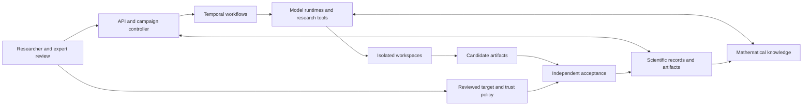

# PhysHarnessV2

**A research harness for model-directed mathematical physics, with independent proof acceptance.**

PhysHarness connects models to research tools, isolated workspaces, shared mathematical records,
and a separate verification service. The goal is to sustain diverse research groups that explore
hard problems, formalize useful results, and build on independently checked work. Models choose
their methods and collaborators; the harness governs execution, resources, provenance, and
acceptance.

[Documentation](docs/README.md) · [Roadmap](docs/ROADMAP.md) ·
[Implementation evidence](docs/IMPLEMENTATION_STATUS.md) · [Contributing](CONTRIBUTING.md) ·
[Issue tracker](https://github.com/zubadestroyer1/PhysHarness2/issues)

> **Development implementation. Every implementation wave remains unqualified.**
> Local tests, a local Temporal integration, synthetic accounting checks, and Linux CI have run.
> CI includes an application-container build and a live PostgreSQL migration test.
> Real Linux Lean and independent-kernel engineering checks now pass two reference proofs and
> seven seeded nonacceptance cases in each mode. Two additional library identities (classical
> oscillator and quantum Pauli-X) and an incomplete-proof rejection also passed in both modes.
> Hosted-model research, live VM fleets, reviewed physics benchmarks, production sandbox
> qualification and new scientific results remain outstanding. The
> [evidence ledger](docs/IMPLEMENTATION_STATUS.md) records what has been checked and what remains.

## What the system is for

- **Autonomous research:** direct attempts, helpers, persistent collaborators, and competing
  approaches, with optional methods rather than a mandatory proof scaffold.
- **Faithful formalization:** exact target revisions, explicit assumptions, expert interpretation
  review, and proof acceptance independent of the submitting agent.
- **Durable collaboration:** retained artifacts and scientific records, context checkpoints,
  resource reservations, and recoverable workflow execution.
- **Honest evidence:** separate statuses for proof, semantic review, assumptions, numerical
  evidence, and novelty. Missing services and unsupported capabilities produce explicit faults.
- **Measured scaling:** compare research policies under recorded budgets before promoting them.
  The roadmap targets 128 active workers, then 1,000; neither capacity is qualified today.

Quantum and classical mathematical-physics programs develop together. Their initial focus is
rigorous known results and reusable prerequisites, followed by nearby open lemmas and harder root
problems. The shipped benchmark fixtures are small, uncompiled algebra cases awaiting expert
review; they are not a qualified physics benchmark.

## How models connect

A researcher configures an experiment with an exact model identifier, runtime, target revision,
and resource envelope. A worker calls the model API, executes authorized tool requests, records
usage and artifacts, and submits candidate results to the acceptance service. The hosted model
runs at its provider; the harness runs the research loop and tools.

The distributed worker currently integrates the **OpenAI Responses API loop**, with optional E2B
workspace tools. Codex, Claude, and OpenHands SDK adapters exist separately and still require
controller integration and live qualification. Installing an SDK or adding an API key does not
complete that qualification. See [runtime capabilities](docs/EXECUTION.md) and
[the first live-run guide](docs/FIRST_LIVE_RUN.md) before launching a paid experiment.

The architectural boundaries are:



The local laboratory uses SQLite and local artifact storage. The managed deployment design uses
PostgreSQL, S3, Temporal, AWS control services, and E2B workers. Deployment configuration and
adapter contracts are present; the [deployment guide](docs/DEPLOYMENT.md) lists qualification gaps.

## Start the local laboratory

Use Python **3.12**, [`uv`](https://docs.astral.sh/uv/), and a supported Node version for the
console: **22.22.2+ within Node 22**, **24.15.0+ within Node 24**, or **26+**. Dependency locks are
committed in `uv.lock` and `console/package-lock.json`.

From the repository root:

```sh
UV_CACHE_DIR=.cache/uv uv sync --locked --all-extras
uv run phys init
uv run phys serve
```

`phys init` creates the development database and separate researcher, reviewer, operator, and
publisher identity files under `.state/`, with private file permissions. It refuses to overwrite
existing identities. Keep those files private. Initialization creates no scientific targets,
reviews, proofs, or paid worker allocations.

The API binds to `http://127.0.0.1:8000` by default; its interactive schema is at `/docs`. In a
second terminal, start the console:

```sh
cd console
npm ci
VITE_API_URL=http://127.0.0.1:8000 npm run dev
```

Open the URL printed by Vite. Connect to the local API using the token in
`.state/researcher.token` at the repository root. The API URL on the connection screen must be
`http://127.0.0.1:8000` for this local setup; enter it there if you did not set `VITE_API_URL`.
The console presents campaigns, targets,
experiments, branches, claims, artifacts, reviews, and resource accounting. It displays missing
services and connection faults explicitly. See the [console guide](docs/CONSOLE.md).

For CLI and MCP access, provide `PHYSHARNESS_URL` and `PHYSHARNESS_TOKEN` through a private
environment or secret manager. `phys request` reads endpoints or submits a JSON file with an
idempotency key; `phys-mcp` exposes research tools through the same API authority. `phys export`
and `phys validate-export` check exported artifact integrity. They do not perform kernel replay.

`/healthz` checks process availability only. Authenticated `/v1/status` reports service
configuration, and `phys doctor` deliberately exits nonzero when required services are missing.
The local API and console can be explored while proof and cloud services remain unconfigured.

## Find your way around

| Location | Responsibility |
|---|---|
| [`src/physharness/`](src/physharness/) | Scientific records, API/client/MCP, acceptance, runtimes, orchestration, knowledge, and evaluation |
| [`console/`](console/) | Private React and TypeScript research console |
| [`formal/`](formal/README.md) | Lean fixtures and explicit toolchain/verification qualification requirements |
| [`benchmarks/`](benchmarks/README.md) | Quantum/classical task registries, provenance, and review status |
| [`tests/`](tests/) | Application, authority, adapter, adversarial, and opt-in integration checks |
| [`infra/`](infra/) and [`migrations/`](migrations/) | Deployment configuration, qualification tools, and database migrations |
| [`examples/`](examples/) | Research-program examples |
| [`docs/`](docs/README.md) | Contracts, operations, implementation evidence, and roadmap |
| [`.github/`](.github/) | Review guidance, issue templates, ownership, and CI workflows |
| [`outputs/`](outputs/) and [`work/`](work/) | Research background and dated engineering evidence; historical reports are not current qualification |

For integration work, start with the [API contract](docs/API_CONTRACT.md). For scientific work,
read [verification](docs/VERIFICATION.md), [source and numerical evidence](docs/SCIENCE.md), and
[evaluation](docs/EVALUATION.md). Operators should start with
[deployment](docs/DEPLOYMENT.md) and [operations](docs/OPERATIONS.md).

## Development and contributions

From the repository root:

```sh
uv run ruff check src tests tools infra migrations
uv run ruff format --check src tests tools infra migrations
uv run pytest -q
uv run python infra/validate_metadata.py
```

In `console/`, run `npm test` and `npm run build`. Unconfigured live PostgreSQL and opt-in local
Temporal tests are skipped explicitly. Test fixtures and simulated transports never confer
scientific acceptance. Read the [evidence ledger](docs/IMPLEMENTATION_STATUS.md) for recorded
results and the limits of each check.

Contributions should connect a concrete issue to a small, reviewable change, with relevant
validation and remaining limitations. See [contribution guidance](CONTRIBUTING.md) and
[project management](docs/PROJECT_MANAGEMENT.md) for triage, ownership, and review. Changes to
acceptance, trusted definitions, credentials, or result promotion require independent review.
Report security concerns through the [security policy](SECURITY.md).

The [roadmap](docs/ROADMAP.md) organizes work into twelve implementation waves. The immediate
qualification priorities are the full physics-library build, expert-reviewed scientific tasks,
deployment-boundary review, and a real model proof followed by accepted-lemma reuse.
The [approved implementation specification](docs/IMPLEMENTATION_PLAN.md)
preserves the full scope: heterogeneous research teams, adaptive search, certified computation,
managed and self-hosted fleets, learning from verified experience, and sustained open-problem
campaigns. Shipping components does not close a wave's scientific or operational gates.

## License

New project code is licensed under [Apache-2.0](LICENSE). Upstream materials retain their own
licenses and provenance; see [NOTICE](NOTICE).
