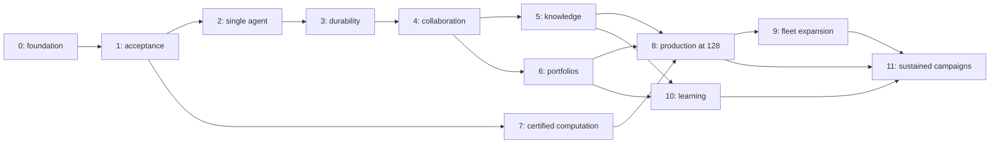

# Qualification roadmap

PhysHarnessV2 advances through evidence, not dates or merged lines of code. All twelve waves
are currently **unqualified**. The [implementation evidence ledger](IMPLEMENTATION_STATUS.md)
distinguishes existing components, recorded tests, engineering gaps and external inputs.

- [Full architecture and implementation scope](IMPLEMENTATION_PLAN.md)
- [GitHub milestones](https://github.com/zubadestroyer1/PhysHarness2/milestones)
- [Wave tracking issues](https://github.com/zubadestroyer1/PhysHarness2/issues?q=is%3Aissue%20label%3Atype%3Aepic)
- [Priority work](https://github.com/zubadestroyer1/PhysHarness2/issues?q=is%3Aopen%20label%3Apriority%3Ap1)
- [Contribution and triage workflow](PROJECT_MANAGEMENT.md)

## Milestones

Each wave has an open milestone and a tracking issue. Closing implementation tasks does not
qualify a wave. Its tracking issue stays open until reviewers accept the complete exit evidence.
No milestone has an invented deadline; later-wave work may proceed when its prerequisites permit.

| Wave | Goal | Evidence required to qualify |
|---|---|---|
| [0](https://github.com/zubadestroyer1/PhysHarness2/issues/2) | Reproducible foundation and two scientific programs | Clean pinned Lean/Mathlib/physics build; declaration audit; 40 expert-reviewed valid targets and 20 negative cases with reference outcomes and family holdouts |
| [1](https://github.com/zubadestroyer1/PhysHarness2/issues/3) | Independent proof acceptance | Actual isolated Linux construction, Comparator and compatible kernels; dependency/axiom audit; seeded attacks rejected or held for semantic review |
| [2](https://github.com/zubadestroyer1/PhysHarness2/issues/4) | Single-agent research loop | Live end-to-end accepted proof and subsequent accepted-lemma reuse in both quantum and classical programs |
| [3](https://github.com/zubadestroyer1/PhysHarness2/issues/5) | Durable managed execution | Managed deployment; VM/controller loss, duplicate delivery, cancellation and pause/resume recovery with preserved records and reconciled resources |
| [4](https://github.com/zubadestroyer1/PhysHarness2/issues/6) | Heterogeneous collaboration and memory | Mixed-runtime team; nested delegation; parent-loss recovery; repeated compaction and handoff preserving assumptions and evidence |
| [5](https://github.com/zubadestroyer1/PhysHarness2/issues/7) | Knowledge and autoformalization | Held-out applicable premise retrieval; provenance-preserving source ingestion; reviewed target and independently accepted formalization |
| [6](https://github.com/zubadestroyer1/PhysHarness2/issues/8) | Test-time scaling and research portfolios | Reproducible matched-cost and matched-time policy comparisons, including uniform allocation; uncertainty and coordination cost reported |
| [7](https://github.com/zubadestroyer1/PhysHarness2/issues/9) | Computation-assisted discovery | Exact computation-assisted checked result in each program; numerical evidence correctly withheld from proof status |
| [8](https://github.com/zubadestroyer1/PhysHarness2/issues/10) | First production platform | Full operational acceptance suite, disaster recovery and a 72-hour mixed workload at 128 active worker slots with fault injection |
| [9](https://github.com/zubadestroyer1/PhysHarness2/issues/11) | Thousand-worker and self-hosted execution | Managed/self-hosted provider contract and recovery suites; 1,000 active workers doing useful work with measured bottlenecks |
| [10](https://github.com/zubadestroyer1/PhysHarness2/issues/12) | Learning from verified experience | Reproducible held-out improvement or cost reduction, rollback and contamination controls; negative results retained if no learned policy qualifies |
| [11](https://github.com/zubadestroyer1/PhysHarness2/issues/13) | Sustained open-problem campaigns | Expert-confirmed nontrivial new results, independently checked proofs and reproducible sustained quantum/classical campaigns toward difficult root targets |

The table is a navigation aid. The [approved specification](IMPLEMENTATION_PLAN.md) defines
the full requirements, including later domain expansion, self-hosted infrastructure and learning.
Scientific discovery remains a research outcome even when its infrastructure passes qualification.

## Dependency order

Quantum and classical programs progress together. Open-problem pilots can start earlier;
they do not establish the full sustained-campaign capability or bypass acceptance requirements.

## Next deliverable

Concentrate the next integration cycle on the Wave 0/1 boundary: a reproducible pinned Linux
formal environment, audited declarations and reviewed targets, followed by real proof acceptance
and attack runs. Keep expert interpretation work and engineering work as separate, linked tasks.
Only then can a live model trial substantiate the single-agent exit criterion.

In parallel, address actual CI failures and recruit an independent reviewer for acceptance,
credentials and result promotion. Later-wave scaffolding is available for development but should
not pull priority away from an executable, trusted end-to-end result.

## Evidence and releases

Qualification reports identify the exact commit, environment and artifact hashes, commands,
resource envelope, skips, failures and reviewer decisions. Label live, replay and mock activity
separately. Attach durable public-safe evidence to issues and update the evidence ledger in the
same reviewed PR. Milestone completion percentages are task counts, not scientific confidence.

A development release can contain useful tested components while its wave remains unqualified.
Release notes must state that distinction. A result package needs the separate scientific review
and acceptance policy described in [verification](VERIFICATION.md) and [science](SCIENCE.md).
