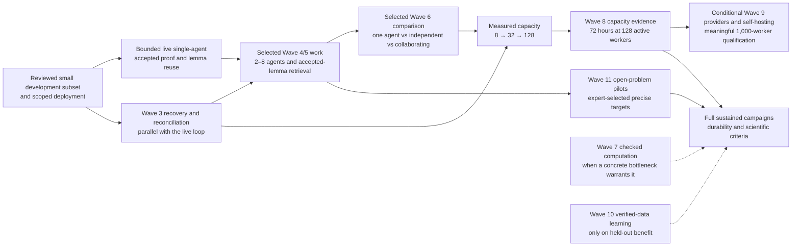

# Qualification roadmap

PhysHarnessV2 advances through evidence, not dates or merged lines of code. All twelve waves
are currently **unqualified**. The [implementation evidence ledger](IMPLEMENTATION_STATUS.md)
distinguishes existing components, recorded tests, engineering gaps and external inputs.

- [Full architecture and implementation scope](IMPLEMENTATION_PLAN.md)
- [GitHub milestones](https://github.com/zubadestroyer1/PhysHarness2/milestones)
- [Wave tracking issues](https://github.com/zubadestroyer1/PhysHarness2/issues?q=is%3Aissue%20label%3Atype%3Aepic)
- [Priority work](https://github.com/zubadestroyer1/PhysHarness2/issues?q=is%3Aopen%20label%3Apriority%3Ap1)
- [Contribution and triage workflow](PROJECT_MANAGEMENT.md)

## Milestones

Each wave has an open milestone and a tracking issue. Closing implementation tasks does not
qualify a wave. Its tracking issue stays open until reviewers accept the complete exit evidence.
No milestone has an invented deadline; later-wave work may proceed when its prerequisites permit.

| Wave | Goal | Evidence required to qualify |
|---|---|---|
| [0](https://github.com/zubadestroyer1/PhysHarness2/issues/2) | Reproducible foundation and two scientific programs | Clean pinned Lean/Mathlib/physics build; declaration audit; 40 expert-reviewed valid targets and 20 negative cases with reference outcomes and family holdouts |
| [1](https://github.com/zubadestroyer1/PhysHarness2/issues/3) | Independent proof acceptance | Actual isolated Linux construction, Comparator and compatible kernels; dependency/axiom audit; seeded attacks rejected or held for semantic review |
| [2](https://github.com/zubadestroyer1/PhysHarness2/issues/4) | Single-agent research loop | Live end-to-end accepted proof and subsequent accepted-lemma reuse in both quantum and classical programs |
| [3](https://github.com/zubadestroyer1/PhysHarness2/issues/5) | Durable managed execution | Managed deployment; VM/controller loss, duplicate delivery, cancellation and pause/resume recovery with preserved records and reconciled resources |
| [4](https://github.com/zubadestroyer1/PhysHarness2/issues/6) | Heterogeneous collaboration and memory | Mixed-runtime team; nested delegation; parent-loss recovery; repeated compaction and handoff preserving assumptions and evidence |
| [5](https://github.com/zubadestroyer1/PhysHarness2/issues/7) | Knowledge and autoformalization | Held-out applicable premise retrieval; provenance-preserving source ingestion; reviewed target and independently accepted formalization |
| [6](https://github.com/zubadestroyer1/PhysHarness2/issues/8) | Test-time scaling and research portfolios | Reproducible matched-cost and matched-time policy comparisons, including uniform allocation; uncertainty and coordination cost reported |
| [7](https://github.com/zubadestroyer1/PhysHarness2/issues/9) | Computation-assisted discovery | Exact computation-assisted checked result in each program; numerical evidence correctly withheld from proof status |
| [8](https://github.com/zubadestroyer1/PhysHarness2/issues/10) | First production platform | Full operational acceptance suite, disaster recovery and a 72-hour mixed workload at 128 active worker slots with fault injection |
| [9](https://github.com/zubadestroyer1/PhysHarness2/issues/11) | Thousand-worker and self-hosted execution | Managed/self-hosted provider contract and recovery suites; 1,000 active workers doing useful work with measured bottlenecks |
| [10](https://github.com/zubadestroyer1/PhysHarness2/issues/12) | Learning from verified experience | Reproducible held-out improvement or cost reduction, rollback and contamination controls; negative results retained if no learned policy qualifies |
| [11](https://github.com/zubadestroyer1/PhysHarness2/issues/13) | Sustained open-problem campaigns | Expert-confirmed nontrivial new results, independently checked proofs and reproducible sustained quantum/classical campaigns toward difficult root targets |

The table is a navigation aid. The [approved specification](IMPLEMENTATION_PLAN.md) defines
the full requirements, including later domain expansion, self-hosted infrastructure and learning.
Scientific discovery remains a research outcome even when its infrastructure passes qualification.

Wave 0's current benchmark inventory is 40 proposed real physics targets plus 20 altered cases;
these are distinct from the tiny algebra controls. References have historical elaboration
evidence, while human scientific review, calibration and contamination review remain open.
The 20 altered cases comprise 11 mechanical nonacceptance controls and nine valid semantic-hold
controls. Wave 1 has current 8 GiB core/library, fixed boundary and host regression evidence;
all 10 automatic qualification checks are mechanically satisfied. Both physics modes
have 60/60 expected reference/control outcomes, with the combined assessment
independently rechecked. Deployment and human gates remain open. See the
[current delivery](../work/wave01/DELIVERY-2026-09-22.md).
These observations apply to the recorded source scope; PR integration changed pinned
input hashes, so current-source qualification requires a fresh scoped run and review.

## Approved execution order (2026-09-22)

The [implementation plan](IMPLEMENTATION_PLAN.md#approved-execution-order-2026-09-22)
sets the task order below. The diagram is a capability and task milestone sequence, not an
exhaustive full-wave qualification dependency graph. It does not change the twelve wave
scopes, the qualification gates in the table above, or the recorded full-qualification
prerequisites. Quantum and classical
programs advance together. A small, reviewed development subset and qualified scoped
deployment can support a bounded live single-agent accepted-proof and lemma-reuse pilot
before all 40 targets are reviewed or a production fleet exists. Every selected target
still needs its required review, and proof acceptance remains independent.

The dotted paths are optional aids to sustained campaigns, not hard prerequisites for an
early open-problem pilot. The full Wave 7 and 10 scopes remain; policy promotion needs
verified data and matched or held-out evidence. Early capacity experiments do not waive
Wave 8's full scope or its complete qualification gates, including Wave 7's recorded
full-qualification prerequisite and the 72-hour run.
Full Wave 11 operational qualification still requires Wave 8; pilots may start sooner.
The full Wave 9 target also remains, but large fleets alone do not establish scientific progress. Wave 9
benchmarks one alternative provider and evaluates existing lifecycle controllers and VM
isolation before choosing any custom Firecracker host pool. Self-hosted capability remains
in scope; Kubernetes and Ray adoption follows measured need.

## Next deliverable

The pinned Linux build and both-mode engineering reference/control runs are recorded.
Next, select and review a small development subset of exact targets under the
[benchmark procedure](PHYSICS_BENCHMARK_REVIEW.md), review the
[scoped qualification packet](../work/wave01/evidence-8g/QUALIFICATION_REVIEW.md)
and coverage gaps with deployment authority, and test the preserved images in a fresh
VM before claiming recovery. Then run a bounded live model-to-accepted-proof trial with
accepted-lemma reuse. In parallel, reconcile uncertain model/VM operations, lease
adoption, orphan cleanup and financial settlement. The next reviewable deliverable is a
reproducible one-agent versus small-team comparison on meaningful physics solves, with
recovery observations and cost/time accounting. Completing this pilot does not qualify
Waves 0–6 or replace review of the full 40-target inventory.

In parallel, address actual CI failures and recruit an independent reviewer for acceptance,
credentials and result promotion. Selected Wave 4/5 small-team work and early Wave 6
matched-budget measurement follow the bounded live loop; scale only after those
measurements identify useful work and operational bottlenecks.

## Evidence and releases

Qualification reports identify the exact commit, environment and artifact hashes, commands,
resource envelope, skips, failures and reviewer decisions. Label live, replay and mock activity
separately. Attach durable public-safe evidence to issues and update the evidence ledger in the
same reviewed PR. Milestone completion percentages are task counts, not scientific confidence.

A development release can contain useful tested components while its wave remains unqualified.
Release notes must state that distinction. A result package needs the separate scientific review
and acceptance policy described in [verification](VERIFICATION.md) and [science](SCIENCE.md).
