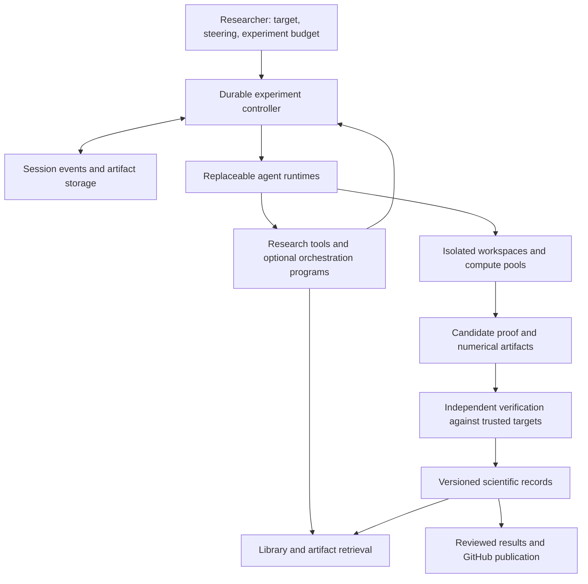

**PhysHarnessV2: comparison with coding-agent harnesses and assessment of the remaining system**

Research date: September 14, 2026. This supplements the [physics and autoformalization research memo](2026-09-14-physics-harness-research.md). It assesses a proposed system; no implementation, deployment, or performance reproduction was performed. Product documentation establishes available interfaces, while vendor experiments supply reported outcomes under particular conditions. Neither establishes performance on open theoretical physics problems.

The direction remains promising. The main architectural revision is to make complete agent runtimes replaceable, alongside models and VM providers. Begin by comparing native coding-agent runtimes with a minimal custom loop. Build the scientific records, acceptance boundary, and experiment coordination ourselves; reuse session and tool machinery when it performs well. Giving a model freedom to choose a strategy is compatible with reliable scheduling and strict proof acceptance.

**What existing systems actually demonstrate**

| System | Evidence reviewed | Useful transfer and practical limit |
|---|---|---|
| [Codex SDK](https://learn.chatgpt.com/docs/codex-sdk) and [app server](https://learn.chatgpt.com/docs/app-server) | Official programmatic interfaces for running and resuming agents; app-server session history, forks, and streamed events. Current SDK documentation includes TypeScript and stable Python support. | Candidate native runtime for Codex workers. Use the SDK for automation. App-server's WebSocket transport is documented as experimental and unsuitable for production; a local SDK integration is a different choice. These interfaces alone do not supply our fleet controller. |
| [Claude Agent SDK](https://code.claude.com/docs/en/agent-sdk/overview) | Official library exposes Claude Code's agent loop, tools, context management, sessions, and subagents. | Candidate native Claude worker. Preserve its capabilities behind an adapter, and keep scientific artifacts portable across runtimes. |
| [Claude dynamic workflows](https://code.claude.com/docs/en/workflows) | Model-written JavaScript coordinates agents and keeps intermediate outputs outside the parent context. Documented limits include at most 16 concurrent agents and 1,000 total per run. A failure can cause later completed agents to rerun on relaunch. | Strong precedent for model-authored orchestration. Use as a comparison backend; its local limits and replay semantics are insufficient for the whole proposed fleet. |
| [Claude agent teams](https://code.claude.com/docs/en/agent-teams) | Persistent peer sessions with a lead. Documentation still calls teams experimental, disallows nested teams, and describes incomplete restoration of in-process teammates. | Distinguish persistent collaborators from short-lived subagents. Do not assume that a CLI team automatically becomes a resilient recursive cloud organization. |
| [Cursor's long-running agent experiments](https://cursor.com/blog/scaling-agents) | Vendor engineering report describes hundreds of concurrent agents, lock contention in flat coordination, planner/worker iterations, and removal of an integrator bottleneck. | Compare several coordination arrangements. Central shared files and a mandatory integrating agent can limit throughput. The report is not a general proof that hierarchy wins. |
| [Cursor/NVIDIA kernel experiment](https://cursor.com/blog/multi-agent-kernels) | Reported three-week experiment over 235 kernel problems using 27 B200 GPUs for benchmarking, with a 38% geometric mean speedup over its stated baselines. | Relevant precedent for allocating workers using executable feedback. Its performance objective and test oracle differ substantially from open proof discovery. It is a research report, not a generally available implementation of the whole harness. |
| [Anthropic's C compiler experiment](https://www.anthropic.com/engineering/building-c-compiler) | Sixteen agents worked through isolated sessions and shared Git integration. Work stalled on a common Linux-compilation blocker; a GCC-based oracle helped isolate independent failures. The resulting compiler retained substantial limitations. | Independent work and diagnostic feedback matter more than agent count alone. Physics often lacks the reference oracle used here. |
| [OpenHands Software Agent SDK](https://docs.openhands.dev/sdk/arch/sdk) and [remote agent server](https://docs.openhands.dev/sdk/guides/agent-server/overview) | Modular conversation state, tools, model integration, and workspaces; remote servers can run in containers on VMs or Kubernetes. | Strong open-source candidate for a common worker runtime. Its APIs merit a compatibility and recovery trial; documentation is not evidence of thousand-agent physics throughput. |
| [Anthropic Managed Agents architecture](https://www.anthropic.com/engineering/managed-agents) | Separates the durable session log, replaceable agent harness, and execution sandbox. | Borrow the separation of failure domains. A Claude-centered hosted service can be a backend, but does not itself meet our heterogeneous-model objective. |
| [Harbor](https://www.harborframework.com/docs/core-concepts) and [mini-SWE-agent](https://mini-swe-agent.com/latest/advanced/v2_migration/) | Harbor runs parallel trials with interchangeable agents and environments. Mini-SWE-agent offers a small agent implementation; current v2 supports native tool calls. | Harbor is an evaluation runner candidate; a minimal loop is an essential baseline. Neither is a complete scientific collaboration system. |

There are three distinct scaling questions. Running many independent experiments tests fleet throughput. Having agents cooperate on one target tests dependency management, communication, and integration. Continuing one investigation for weeks tests memory, recovery, and sustained reasoning. A system can perform well on one and poorly on the others. Verifier capacity is a further shared constraint across all three.

**Assessment of our proposed components**

| Component | Assessment of the design so far | Next concrete design requirement |
|---|---|---|
| Scientific acceptance | Substantially specified, but unimplemented and untested | Trusted problem definitions, transitive dependency checking, independent verification, and separate semantic review |
| Solving strategy | Appropriate flexibility; performance remains an empirical question | Compare direct attempts, independent portfolios, and model-authored coordination at matched budgets |
| Worker runtime | Previously underspecified | Capability-aware adapters for native runtimes and a minimal loop; preserve provider-specific state |
| Context and compaction | Good intent, insufficient operational detail | Separate complete records, active context, and accepted scientific state; test resumption after information loss |
| Collaboration lifecycle | Largest remaining coordination gap | Durable identities, asynchronous messages, task leases, dependency subscriptions, and explicit completion states |
| VM infrastructure | Suitable provider candidates identified | Recovery independent of snapshots, consistent forks, pinned images, separate resource pools, and capacity tests |
| Integration and lemma reuse | Strong concept, needs concrete protocol | Versioned imports, assumption compatibility, clean recomposition checks, and curated publication |
| Observability and evaluation | Metrics identified, no measurements yet | Track useful progress and failure modes; compare native runtimes before committing to a custom loop |

These assessments are design judgments, not implementation maturity scores.

**Recommended architecture**

The diagram describes responsibilities, not necessarily separate network services in the first implementation. Scientific planners may run within the worker layer; the durable controller handles execution facts without choosing every mathematical step.

1. **Reuse complete agent runtimes where they help.**

An adapter should support starting, continuing, interrupting, resuming, and exporting a session; describe available delegation, tool, context, and workspace features; and report model and runtime versions. Avoid pretending all providers implement identical semantics. A model substitution must be visible in experiment metadata. A native runtime may retain capabilities that a generic text/tool loop loses, but its benefit on physics needs measurement.

Initial candidates are a Codex SDK worker, a Claude Agent SDK worker, and either an OpenHands worker or a small direct-API baseline. They receive comparable domain tools and the same acceptance conditions. Do not build all integrations before obtaining one end-to-end verified result.

2. **Allow model-authored orchestration as an optional artifact.**

Agents should be able to produce a small program that launches independent attempts, waits for evidence, starts a collaborator, or forks a promising route. Keep these programs versioned and inspectable. Anthropic's [dynamic-workflow engineering article](https://claude.com/blog/a-harness-for-every-task-dynamic-workflows-in-claude-code) is a direct precedent for this approach.

Our proposed extension is a provider-neutral set of durable operations. Programs can request computation and propose research organization; they cannot modify accepted results, trusted checkers, or the experiment's resource authority. Record nondeterministic inputs and stable operation IDs. A script edit creates a new workflow revision with explicit result reuse, rather than quietly replaying old actions under changed logic. A model may still work directly without writing a program.

3. **Make delegation asynchronous and recoverable.**

Support three relationships: a short helper returning one artifact, a persistent collaborator with its own evolving context, and an independent competing branch. These are different lifecycles. Parents can subscribe to completion, continue useful work, or wait without spending model tokens on polling. Store actual task state outside the model's task list. A final assistant message ends a turn; it does not establish that the experiment's scientific goal is achieved.

Use renewable leases where exclusive ownership is necessary, plus version checks that prevent a worker whose lease expired from overwriting a newer result. Intentional competing attempts remain allowed. Messages need IDs, acknowledgements, expiry or supersession, and links to the target revision. Bound recursive spawning against the experiment budget without requiring approval for routine allocations. Recover orphaned children when a parent disappears.

4. **Treat compaction as a fallible view of durable evidence.**

Maintain the complete retained event/artifact record, a runtime-specific active context, and canonical scientific records. OpenHands' [condenser architecture](https://docs.openhands.dev/sdk/arch/condenser) explicitly constructs model-facing views through condensation events. OpenAI's [compaction API](https://developers.openai.com/api/docs/guides/compaction) can return opaque encrypted state; that state should not be assumed interpretable or portable to another provider.

In our system, a worker can retrieve older evidence by reference. Its restart brief includes the exact target revision, assumptions, accepted lemmas, unresolved obligations, and useful failed approaches. Summaries cannot turn conjectures into accepted facts. Keep native continuation state for same-runtime resumption, alongside portable artifact references for cross-model handoff. A fresh reviewer usually benefits from the target and evidence without inheriting the author's entire narrative.

Add an explicit compaction evaluation: after several resets, does the agent still preserve boundary conditions, quantifiers, unresolved steps, and reasons previous approaches failed? Test effective continuation, not only whether the session API returns successfully.

5. **Separate scientific durability from VM lifetime.**

Store accepted artifacts and session checkpoints outside worker machines. Provision pinned Lean/library images and trusted read-only import caches with private writable build areas. A workspace branch is useful isolation for edits; it is not the security boundary between untrusted generated code and the acceptance service.

Use [E2B snapshots](https://docs.e2b.dev/sandbox/snapshots) as an acceleration mechanism to evaluate, not the only backup. Our fork must associate a consistent workspace revision, session checkpoint, target revision, environment identity, and branch lineage. Reissue execution identities and leases in the child; cloning a live VM must not duplicate the authority to complete the parent's pending operations.

Scale hosted-model calls, Lean checking, local inference, and simulation separately. Backpressure should reflect verifier queues, model quotas, and available CPU/RAM/GPU capacity. Generous resources remain appropriate; preserving idle machines for every dormant idea is unnecessary. A model's context limit remains separate from VM memory.

6. **Invest heavily in tool feedback and integration.**

Offer ordinary shell/file tools plus precise Lean diagnostics, library search, proof-state access, numerical execution, and artifact inspection. Return short summaries with source locations and handles to complete logs. Keep a fast exploratory checking path and an independent final acceptance path. Tool timeouts, invalid proofs, false conjectures, and infrastructure failures need distinct outcomes.

Each branch should work in an isolated writable workspace. Merge artifacts against explicit dependency versions, then rebuild the combined result in a clean environment. Two lemmas that compile separately can still be unusable together because their definitions or assumptions differ. Resolve representation differences through checked bridges. No single integrating model should be mandatory for every artifact, although an agent can help resolve a difficult integration.

7. **Measure whether collaboration produces useful independent work.**

Detect repeated diagnostics, identical attempted lemmas, shared unresolved dependencies, and incompatible definition choices. Use these as prompts for replanning and resource allocation; they are not automatic proofs that an approach is exhausted. Preserve sustained work on hard branches while evaluating alternatives.

The compiler experiment makes the limitation concrete: a shared blocker can defeat nominal parallelism. For physics, independently useful outputs may include a checked special case, an exact counterexample, a bridge between representations, or a prerequisite used by several strategies. Numerical agreement and collections of easy lemmas must not masquerade as progress on the target. The root proof remains the acceptance criterion when the experiment's objective is a proof.

8. **Keep orchestration durable without building two competing controllers.**

[Temporal activities](https://docs.temporal.io/activity-definition) may retry; operation IDs and application-level deduplication are required. Record completed calls and reconcile uncertain outcomes before reissuing expensive external work. There is no general exactly-once guarantee for model billing. Keep model/tool I/O out of deterministic workflow code and keep large outputs in artifact storage.

[LangGraph persistence](https://docs.langchain.com/oss/python/langgraph/persistence) is an alternative worth comparing if its execution model fits the prototype better. Its graph abstraction need not prescribe a mathematical strategy. Choose one primary durability mechanism initially. Ray/KubeRay can later execute workloads that justify a cluster; they should not become the sole store of scientific truth.

9. **Make the experiment observable and steerable.**

The researcher should see active approaches, exact open obligations, accepted and conditional results, duplicated work, queue delays, costs, and reasons work stopped. They should be able to redirect a branch, change priorities, or amend a target as a new revision without losing prior evidence. Record visible model outputs, tool events, environment versions, and artifact provenance; the design must not require access to unavailable internal reasoning.

Keep speculative histories in experiment storage. Use GitHub PRs for reviewed library additions, harness changes, and reproducible result packages. Required checks should cover the accepted artifact's actual dependency closure under the pinned environment. Publishing volume is not a research progress metric.

**What to build and test first**

The first milestone should demonstrate one complete lifecycle: a worker explores a reviewed mathematical-physics target, optionally delegates, produces a candidate, survives interruption, and submits it to an independent checker. Its accepted result can then be reused in a second target. This exercises the main system boundaries without requiring a large cluster.

After that, compare a minimal worker, a native coding-agent worker, independent parallel attempts, and model-authored collaboration. Hold the task set, allowed libraries, acceptance policy, and resource accounting fixed. Measure success against total cost and elapsed time; also report tokens, runtime overhead, verifier usage, and actual model configurations. Compare both cold-start and warmed environments when relevant.

| Evaluation | What would justify the design choice |
|---|---|
| Native runtime versus minimal loop | Improved accepted-target rate, cost, or recovery sufficient to justify integration and model coupling |
| Independent attempts versus collaboration | More valid completed targets or reusable enabling results after accounting for coordination overhead |
| Compaction and cross-model handoff | Preserved assumptions and evidence status, with useful continuation across repeated resets |
| Worker/controller failure and duplicate delivery | No lost accepted results, forged completion, stale overwrite, or uncontrolled duplicate allocation |
| Concurrent workspace integration | Independently obtained artifacts compose and pass clean final verification |
| Concurrency ramp | Throughput and recovery remain acceptable as generation and checker load increase; report observed limits |
| Target amendment during a run | New work uses the new revision; old results retain accurate provenance and cannot silently satisfy the amended target |

Use a small reviewed family of known results and nearby lemmas first. Reproduction, new formalization, and open-result discovery must have distinct labels. We should select the initial agent backend and cloud provider through these experiments rather than treating any vendor's coding result as evidence that it will be best for physics.

The immediate design priority is a precise contract for a session, branch, task, artifact, target revision, and verification receipt. That contract lets existing runtimes participate while preserving trustworthy scientific state across models, machines, and months of work.
