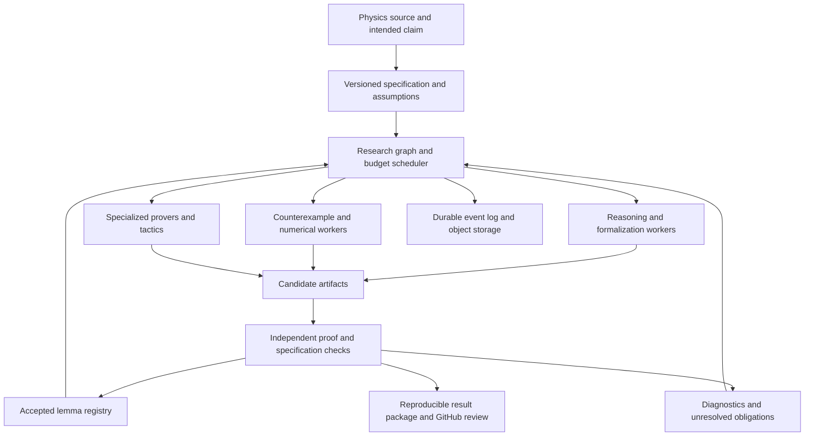

**Research and initial architecture recommendations for PhysHarnessV2**

Research date: September 14, 2026. This is a discussion memo, not an approved implementation specification. The starting domain is rigorous mathematical physics: reproduce known results, build reusable foundations, then investigate nearby open lemmas. Findings below come from primary papers, project repositories, and official documentation. Published performance claims have not been independently reproduced here; no infrastructure has been deployed or load-tested. This is a selected survey of relevant frontier methods, not an exhaustive ranking of every current prover.

My revised recommendation is to build a durable research runtime with replaceable models and execution providers, allowing models to choose their own solving process. A versioned graph records mathematical claims and dependencies as work develops; it is not a mandatory plan through which every reasoning step must pass. Its distinctive work should be faithful specifications, explicit assumptions, reliable proof checking, useful lemma reuse, and elastic execution. Existing systems already supply much of the execution and proof-search machinery.

The subsequent [coding-harness comparison and system assessment](2026-09-14-coding-harness-comparison.md) extends this to replaceable complete agent runtimes. It recommends testing native Codex and Claude SDK workers, OpenHands, and a minimal loop before choosing a default; adds model-authored orchestration as an optional capability; and details session recovery, compaction, asynchronous collaboration, and integration requirements.

The user's follow-up raises a useful design hypothesis: imposing a proof strategy, mandatory role hierarchy, or fixed decomposition sequence may suppress capable models. We should make those strategies optional skills and experiment configurations. Anthropic's [harness engineering report](https://www.anthropic.com/engineering/harness-design-long-running-apps) describes scaffolding assumptions becoming stale as models improve, while also finding some structure useful. That is evidence from software tasks, not a demonstrated result for physics; compare approaches empirically.

The model should be able to work on the full problem, investigate an analogy, perform calculations, build a custom search script, or recruit collaborators. Optional skills explain capabilities such as spawning researchers, forking experiments, searching libraries, checking Lean, and checkpointing. Real runtime tools implement those operations with durable records; prompt instructions alone cannot supply reliability. The fixed boundaries concern what counts as an accepted result and who can modify the trusted checker, not how the model must think.

The subsequent discussion sharpens this recommendation: optional tools alone are too passive. The harness should actively support multiple independent strategy proposals, evidence-driven allocation, and opportunities for global replanning, while preserving autonomy inside each attempt. The experiment can include direct attempts, model-generated decompositions, premise discovery, and diagnostic searches concurrently. These are configurable search policies, not a fixed list of mathematical methods every target must follow. The objective is the probability of a valid solution within an experiment budget, accounting for correlated failures and coordination costs.

For example, strategy proposals can state their main mathematical idea, representation, required results, hardest unknown step, and a cheap test of feasibility. Independent proposals should initially be produced without reading one another. Short attempts then supply concrete evidence for further allocation; model confidence alone is insufficient. Promising routes receive sustained work, while some capacity continues exploring alternative routes. Protect deep attempts from repeated interruption, and preserve checkpoints of approaches that are paused. No universal allocation percentage is established by the sources reviewed here.

When a model proposes a decomposition, an optional conditional Lean proof can establish that its named obligations would suffice for the target. That does not prove the obligations, their consistency, or their tractability. Where appropriate, test the hardest obligation early. Failure analysis should distinguish a missing library fact, a translation defect, a false intermediate statement, a circular restatement of the target, and an unresolved mathematical obstacle. A model's diagnosis is tentative until supported. Allow replanning to replace the global approach rather than endlessly subdividing its most difficult step.

Add [Goedel-Architect](https://arxiv.org/abs/2606.06468) to the highest-priority baselines. It generates formal dependency blueprints, attempts lemma nodes in parallel, and uses failures to revise the global blueprint. Its distinction between local proving and global strategy revision is directly relevant to this concern. Its reported benchmark performance has not been reproduced here and does not establish transfer to open physics problems.

Also examine [compiler-guided adaptive search with cross-model generation](https://arxiv.org/abs/2608.18084), which studies preserving promising proof attempts and resampling after stagnation, and [LeanSearch v2](https://arxiv.org/abs/2605.13137), which retrieves groups of premises needed by a theorem. These suggest implementable experiments on restart policy and strategy-level retrieval. A broader [agent-scaling study](https://research.google/blog/towards-a-science-of-scaling-agent-systems-when-and-why-agent-systems-work/) finds that coordination can help parallelizable tasks and hurt sequential ones; its benchmarks are not physics. We should measure both breadth and sustained depth instead of assuming that increasing workers increases success.

Communication should exchange compact, attributable artifacts. Accepted lemmas include statements, hypotheses, and dependency versions. Unverified conjectures and failed attempts remain available with their status. Reusing a theorem across different representations requires a checked bridge or explicit matching of definitions. Avoid mandatory all-agent discussions or a single planning model whose preferred strategy controls every worker. The controller should use a mixture of observed verification outcomes and explicitly uncertain progress estimates; a large count of easy lemmas is not evidence of progress toward the root theorem.

**The current foundation has changed.** PhysLean and Lean-QuantumInfo have merged into [Physlib](https://github.com/leanprover-community/physlib). The repository distinguishes a curated core, a faster-moving PhyslibAlpha tier, and QuantumInfo, whose conventions are still being integrated. Lean is the proof assistant; Physlib is a library built on Lean and Mathlib. We should audit and pin the subset we use, including its definitions and maintenance status, rather than equating library membership with a completed semantic review.

The project should begin by investigating finite-dimensional quantum information and matrix/operator inequalities as its first domain. This is a recommendation based on the available ecosystem, not a claim that every required result is already formalized. Before choosing specific tasks, inventory their complete dependency requirements. Avoid an initial target whose central objects still need a major foundational development.

The following systems offer the most useful precedents:

| System | Documented capability | What to reuse or investigate |
|---|---|---|
| [MerLean](https://arxiv.org/abs/2602.16554), February 2026 | Paper-to-Lean autoformalization in quantum computation, with reverse translation for semantic review. Its three-paper evaluation includes explicit axioms for missing machinery. | Source-to-declaration mapping and readable review artifacts. Track assumed results distinctly from proved results. |
| [MerLean-Prover](https://arxiv.org/html/2605.26959v1), May 2026 | Recursive planning, Lean-writing, and independent checking roles; an anchored target; dependency invalidation after plan changes. | Closest architectural reference for decomposition. Its proof-loop evaluation starts with Lean targets; this is distinct from end-to-end informal problem formalization. The paper describes a dependency-ordered loop, not evidence of a production fleet at our intended scale. |
| [Hilbert](https://arxiv.org/html/2509.22819v1), September 2025 | Coordinates a general reasoner, specialized prover, formal verifier, and theorem retriever. Recursively decomposes failed targets and assembles proofs. | A mixed-model baseline. Explicitly verify that a proposed decomposition suffices for the parent target before spending heavily on its children. |
| [Aristotle](https://arxiv.org/abs/2510.01346), October 2025 | Combines formal proof search, informal lemma generation/formalization, and a geometry solver. | An architectural precedent and potential external prover integration. Public descriptions do not make its full internal infrastructure available for reuse. |
| [Kimina Lean Server](https://github.com/project-numina/kimina-lean-server) | A Lean REPL service with parallel checking and a Python client. | Evaluate as a pooled checking backend; measure memory, import warm-up, throughput, cancellation, and version compatibility on physics workloads. |
| [Pantograph](https://github.com/stanford-centaur/PyPantograph) and [LeanDojo-v2](https://github.com/lean-dojo/LeanDojo-v2) | Programmatic proof-state interaction; repository tracing, retrieval, training, and proving components. Pantograph handles coupled metavariables. | Tactic search and premise indexing. Do not treat every displayed subgoal as independent: shared metavariables can couple them. |
| [AutoformBot](https://github.com/facebookresearch/autoform-bot) | Source-grounded roadmaps, dependency validation, review, and progress publication. Autonomous orchestration is an opt-in `execution` branch rather than the default `main` capability. | Study roadmap and publication conventions. Evaluate the execution branch separately before depending on it. |
| [ProofWala](https://arxiv.org/abs/2502.04671) | A common interface across proof assistants and parallel proof search. | Search-experiment design and a possible future interface to other proof assistants. Multiple assistants need not be a first-release requirement. |
| [LeanHammer](https://github.com/JOSHCLUNE/LeanHammer) | Premise selection with multiple automated provers and Lean proof reconstruction techniques. | Try conventional automation before expensive model calls. External solver output must meet the selected proof-validation policy. |

Models are a separate choice from harnesses. [DeepSeek-Prover-V2](https://arxiv.org/abs/2504.21801) uses recursive decomposition in its data-generation pipeline; [Goedel-Prover-V2](https://arxiv.org/abs/2508.03613) studies scaffolded synthesis and self-correction. These inform worker strategies without supplying a complete durable physics platform. [Leanstral 1.5](https://mistral.ai/fr/news/leanstral-1-5/) is a newer open-weight proof-engineering candidate worth testing. Mistral's [changelog](https://docs.mistral.ai/resources/changelogs) schedules its hosted model for retirement on September 30, 2026, so an integration should not assume a permanent preview endpoint.

Choose models using our own cost-controlled tasks. Contest benchmark scores across different samples, budgets, library versions, and theorem sets do not establish superiority on mathematical physics. A smaller model is not necessarily cheaper per successful proof if it creates more failed attempts and longer plans.

The cloud stack has several distinct responsibilities:

| Component | Evidence and fit | Recommendation / limitation |
|---|---|---|
| E2B | Documents a [Firecracker microVM per sandbox](https://e2b.dev/security) and [filesystem/memory persistence](https://docs.e2b.dev/sandbox/persistence). | First candidate for managed VM workers. Validate custom Lean images, networking, capacity, pause/resume behavior, and effective cost under load. |
| Modal | Documents [sandbox snapshots](https://modal.com/docs/guide/sandbox-snapshots) and a separate [VM runtime in beta](https://modal.com/docs/guide/vm-sandboxes). Ordinary sandboxes use gVisor. | Strong alternative, especially when comparing hosted inference and execution. Filesystem snapshots currently have a default 30-day retention; memory snapshots are alpha with shorter retention. Persist durable artifacts independently. |
| Daytona | Offers default containers plus explicit [VM sandboxes](https://www.daytona.io/docs/sandboxes), with fork and lifecycle operations. | Include in the provider comparison. Select the VM runtime explicitly when VM isolation is required; do not infer it from the word sandbox. |
| Firecracker | Supplies microVM execution and [snapshot mechanisms](https://github.com/firecracker-microvm/firecracker/blob/main/docs/snapshotting/snapshot-support.md). Snapshot packaging and lifecycle are outside its scope. | A later self-hosting option. Operating a secure host fleet, storage, networking, placement, image distribution, and recovery would remain our responsibility. |
| Temporal | Provides durable workflows; [Continue-As-New](https://docs.temporal.io/workflow-execution/continue-as-new) bounds workflow histories. [Activities](https://docs.temporal.io/activity-definition) may retry and should be idempotent. | Candidate for durable experiment and branch orchestration. Keep model calls and tool I/O in activities; use request IDs and recorded outputs. Do not assume exactly-once external billing. |
| Ray / KubeRay | Provides distributed execution and [Kubernetes management](https://docs.ray.io/en/latest/cluster/kubernetes/getting-started.html). [Object recovery](https://docs.ray.io/en/latest/ray-core/fault_tolerance/objects.html) has owner-failure limits, and [GCS resilience](https://docs.ray.io/en/latest/cluster/kubernetes/user-guides/kuberay-gcs-ft.html) requires additional configuration. | Add when batch compute, self-hosted inference, or training justifies it. Durable scientific records belong outside the Ray object store. |
| Harbor | Defines tasks, trials, parallel jobs, and [provider adapters](https://www.harborframework.com/docs/core-concepts). | Reuse or adapt for benchmark execution. Its job abstractions do not themselves implement our shared research graph or proof acceptance policy. |
| OpenHands | Provides [remote agent servers](https://docs.openhands.dev/sdk/guides/agent-server/overview) and [context condensation](https://docs.openhands.dev/sdk/guides/context-condenser). | Candidate agent runtime. Test resumability and model compatibility, while keeping authoritative mathematical state in our own records. |

There are three plausible build approaches. My preferred approach is a small custom scientific core using existing proving tools, a durable workflow engine, and managed VM workers. This gives us control of the acceptance rules without requiring a cloud platform project. A second approach wraps MerLean or AutoformBot more directly; it should reach a baseline sooner but may inherit assumptions about models, storage, and scheduling that complicate controlled experiments. A third approach owns Kubernetes, Ray, and a microVM fleet from the beginning; it offers infrastructure control at substantially greater engineering cost. We should choose it only when measured workload or deployment requirements justify that cost.

The recommended architecture is provisional:

The graph should represent competing approaches and their dependencies when agents create them. A strategy may require all of several lemmas, while competing strategies offer alternative ways to prove the same claim. Support an AND/OR search representation without requiring agents to use it for every attempt. Derive formal dependency edges from accepted artifacts where possible; a model can submit a complete proof without an earlier plan. Persistent claim records should include the exact formal statement, relevant definitions, physical assumptions, source correspondence, dependency revisions, attempts, and verification evidence. Informal notebooks and incomplete hypotheses can coexist with those records.

Agent objectives and team organization are model-directed: an invocation may pursue the full problem or a delegated subproblem. Agents request collaborators, branches, or larger resources through the runtime. Routine allocations within a generous experiment budget should be automatic; spawning cannot multiply that total budget. Models can propose plans and proofs but cannot assign accepted status to their own work. Versioned leases prevent accidental duplicate ownership where needed, while intentional competing attempts remain possible. Outputs from stale graph revisions cannot silently replace newer results.

Compaction should produce a working summary with references to immutable artifacts: the target, assumptions, accepted dependencies, pending obligations, attempted methods, and useful diagnostics. Summaries remain fallible. Restarting a worker should reconstruct its task from canonical records, and every mathematical assertion in a summary should retain its evidence status. A VM snapshot accelerates resumption; it does not replace this record.

Use persistent database records for metadata and append-only events, plus content-addressed object storage for source files, transcripts, model responses, proof artifacts, and large numerical results. Keep workflow messages small by passing artifact references. Address retries, cancellation, lost workers, stale results, and artifact corruption explicitly. Long-run replay means reproducing the recorded experiment and rechecking its artifacts; fresh hosted model calls may produce different outputs even with the same seed.

Scale execution pools separately: orchestration and hosted-model calls are often I/O-heavy; Lean compilation and checking consume CPU and memory; local model inference consumes GPUs; simulations may have a different resource profile. Prebuild pinned Lean/Mathlib/Physlib images, reuse trusted import caches, and recycle checking processes under memory limits. Schedule against verifier queue depth and model quotas so a large generation fleet cannot overwhelm checking.

**Acceptance needs more than a successful Lean build.** Lean's own [validation guidance](https://lean-lang.org/doc/reference/latest/ValidatingProofs/) distinguishes an accepted proof from the meaning of its statement and recommends stronger checks for adversarial submissions. Our threat model includes optimization pressure that encourages easy substitutes for the requested theorem. The following controls are design recommendations:

1. Freeze a reviewed challenge and its relevant definitions outside the solver workspace. Record variables, quantifiers, domains, conventions, regularity, boundary conditions, approximations, and the physical model. A target change creates a new problem revision.
2. When an agent chooses decomposition, require the final proof to establish how its child results imply the parent before accepting that parent. No decomposition or advance composition proof is mandatory for exploration. Intermediate sketches may contain holes, but a hole is an open obligation and never counts as a completed proof. Missing mathematical foundations remain explicit dependencies.
3. Audit the complete dependency closure. Reject `sorryAx` and unapproved axioms. Permit the chosen standard logical foundations, and distinguish physical hypotheses in the statement from newly asserted mathematical axioms. The current [Lean axiom documentation](https://lean-lang.org/doc/reference/latest/Axioms/) also shows that native computation can introduce additional trust; a strict tier should reject it unless supported by the agreed certificate policy.
4. Use [Comparator](https://github.com/leanprover/comparator) to compare the solution against the trusted challenge, enforce permitted axioms, and enable a compatible independent kernel checker for high-assurance results. Pin versions and validate its sandbox requirements. A raw source-signature hash cannot catch all changes in referenced definitions or interpretation.
5. Perform construction/export in an isolated environment and checking outside the submitting agent's control. Workers must not be able to edit checker binaries, expected targets, trust settings, accepted artifacts, or verification receipts. Cached artifacts have explicit provenance.
6. Review semantic faithfulness independently against the physics source. Round-trip translation, adversarial review, type and dimension checks, and examples can expose mistakes; they cannot generally prove that natural language was translated correctly. Focus expert review on target definitions, newly introduced concepts, major assumptions, and publication claims.

Comparator itself warns that freely fillable definition holes can be gamed. For example, defining a requested answer in terms of the original unresolved conjecture may yield a trivial equivalence proof. Such constructions require separate semantic constraints and review. This is why protecting a theorem's visible text alone is insufficient.

Record several dimensions of evidence instead of one ambiguous green badge: proof checked or incomplete; specification reviewed or unreviewed; exact assumptions; numerical evidence; and novelty status. A theorem proved under an extra physical approximation remains conditional on that approximation. A simulation is evidence. A timeout establishes neither falsity nor truth.

The August 2026 [FaithformBench study](https://arxiv.org/abs/2608.10916) reports that autoformalizers can silently convert invalid inputs into provable statements. Include deliberately false and perturbed inputs in our evaluations. A high compilation rate alone can reward precisely the behavior we want to prevent.

Additional capabilities worth designing for are:

| Capability | Proposed behavior | Why it belongs / when to add it |
|---|---|---|
| Refutation alongside proof | Search for small counterexamples, violations of assumptions, limiting cases, and incompatible constraints. Turn exact witnesses into checked refutations when possible. | Early. Avoid spending the entire budget proving a false or badly stated claim. |
| Hybrid numerical and formal work | Use symbolic algebra, simulations, interval methods, or optimization to suggest identities, bounds, and constructions. Require checked certificates or explicit error bounds for formal acceptance. | Early exploratory lane, with certification added for selected task families. Floating-point agreement is never a proof by itself. |
| Adaptive strategy portfolio | Compare direct whole-proof attempts, compiler-guided repair, tactic search, recursive decomposition, and conjectured helper lemmas. Allocate resources using measured outcomes and uncertainty. | Early baselines first; adaptive scheduling after enough observations. Do not assume MCTS or a large hierarchy wins universally. |
| Independent research groups | Let groups explore different methods, representations, and model families before exchanging selected artifacts. Share validated lemmas promptly; share conjectures with explicit status. | Test whether delayed sharing preserves useful diversity. Unrestricted all-to-all communication can create duplication and correlated errors. |
| Goal-directed library growth | Identify dependencies that block multiple promising strategies; assign agents to formalize, generalize, and document them. | Early. Favor downstream usefulness over raw counts of lemmas or lines. |
| Strong premise retrieval | Combine lexical and semantic search with types, required assumptions, namespaces, dependency versions, and actual elaboration checks. Include Mathlib, vetted Physlib modules, and our accepted lemmas. | Early. Semantic similarity alone does not establish applicability. |
| Persistent failure knowledge | Store failed approaches with exact conditions, diagnostics, and whether failure was mathematical, formalization-related, or merely a budget exhaustion. | Early. Avoid repeating work without turning failed searches into false impossibility claims. |
| Learned search and curricula | Train premise retrieval or proof policies on accepted artifacts; retain held-out tasks and provenance. [LeanAgent](https://arxiv.org/abs/2410.06209) studies continual learning with a growing knowledge base. | Later, when verified data and evaluation are reliable. |
| Test-time reinforcement learning | Adapt open-weight models on mechanically verified related tasks. [AlphaProof](https://www.nature.com/articles/s41586-025-09833-y) provides a major precedent. | Later. Requires trainable models, substantial compute, and a reward that cannot be satisfied by altered targets. It is different from sampling a fixed API model repeatedly. |
| Evolutionary discovery | Maintain diverse populations of constructions or computational methods, evaluated against fixed criteria. [AlphaEvolve](https://arxiv.org/abs/2506.13131) demonstrates this pattern. | Useful for constructive and computational subproblems. Adapting it to physics conjecture search is a proposed extension, not an established guarantee. |
| Active use of experts | Route ambiguous definitions, high-impact assumptions, and repeated foundational failures to expert review. | Early. Human time should resolve uncertainty at the specification boundary rather than approve every tactic. |

The key pushback is about optimization targets. We should optimize verified progress toward meaningful targets per unit of time and cost. Agent count, token count, and derivation length are poor substitutes. Direct reuse of an allowed theorem is valid; in a benchmark intended to measure discovery, access to the target proof and equivalent leakage must instead be controlled explicitly. The system must distinguish rediscovery, a new formalization, and a new mathematical result.

Our first experiments should answer the following questions before a large deployment:

| Experiment | Comparison / measure |
|---|---|
| Physics coverage inventory | For a small related task family, identify existing definitions, missing prerequisites, accepted assumptions, and a reviewed reference statement. |
| Capability baseline | Single strong agent; independent repeated attempts; recursive decomposition; and a mixed-model group, at matched cost and wall-clock budgets. |
| Collaboration benefit | No sharing, verified-lemma sharing, and broader idea sharing. Measure solved targets, useful lemma reuse, duplicated work, and review effort. |
| Formalization fidelity | Known-correct and deliberately invalid inputs; changed quantifiers; omitted domains; overstrong hypotheses; empty domains; inconsistent assumptions; and misleading definitions. |
| Verification resistance | Hidden dependency holes, user axioms, changed target definitions, tampered toolchains, forged success files, stale artifacts, and unapproved native-computation dependencies. |
| Durability | Kill workers, restart the controller, repeat deliveries, interrupt compilation, and restore after compaction. Accepted results and budgets must remain consistent. |
| Scaling | Ramp concurrency through small pilot levels, such as 1, 8, 32, and 128, subject to explicit experiment budgets. Measure queue times, memory, successful checks per resource-hour, lost work, and cost per accepted target. These numbers are proposed test points, not demonstrated capacity. |
| Scientific progress | Evaluate recovery of known results, useful foundational additions, and carefully selected nearby open lemmas separately. Preserve unresolved outcomes. |

Track end-to-end success, expert-adjudicated false acceptance on audited samples, proof-checking throughput, cost, time, dependency reuse, restart recovery, and specification-review effort. Finite tests cannot demonstrate a universal zero false-acceptance rate. Freeze benchmark libraries and retrieval corpora, mask target proofs and leaking descendants where practical, and label literature-assisted runs separately. Pretraining contamination cannot generally be ruled out, so include fresh expert-authored tasks and meaning-preserving perturbations. Transfer to unseen problems is the relevant test of learned improvements.

GitHub should make the project inspectable from its first development milestone. Use small reviewed PRs for the harness and curated formal library; record architecture decisions; protect acceptance code and challenge definitions with required review; pin dependencies; and run independent verification in CI. A result PR should include the original claim, formal statement, assumptions, dependency graph, verification report, source provenance, experiment configuration, resource usage, and exact artifact identifiers. Record failed and inconclusive experiments too.

Thousands of speculative search branches belong in experiment storage. Curated results and experiment reports should link that evidence from GitHub. Every accepted proof should rebuild from a clean checkout under the recorded environment. Publish readable blueprints alongside Lean source so physicists can review what was established. Release code, proof artifacts, data, and reproducibility recipes with their applicable provenance and licenses.

For the revised design, start with a small Python scientific core and replaceable, capability-aware agent-runtime adapters. Compare native coding-agent SDKs with OpenHands and a minimal provider-API loop; do not assume a newly built loop preserves every useful native capability. Keep model-specific reasoning and context features available. [Claude Managed Agents](https://www.anthropic.com/engineering/managed-agents) offers hosted long-running execution with separated sessions, harnesses, and sandboxes; it is a useful comparison backend, but a Claude-centered service would not by itself satisfy our heterogeneous-model requirement.

[E2B snapshots](https://docs.e2b.dev/sandbox/snapshots) can create multiple machines from one captured filesystem and memory state. Our fork operation must additionally record a branch ID, transcript/context checkpoint, model configuration, and provenance; a VM snapshot does not capture state held by an external model provider. Models may request larger machines or more workers, but more VM RAM does not enlarge an LLM's context window. Preserve retrievable history, compaction support, and configurable experiment-level spending and concurrency envelopes.

For supporting services, [managed Postgres such as Supabase](https://supabase.com/docs/guides/database/overview) can hold metadata, with object storage for large artifacts. [Langfuse](https://langfuse.com/docs) can provide model-call tracing, cost/latency visibility, and experiment comparisons. These traces supplement the canonical scientific record. [GitHub Actions](https://docs.github.com/en/actions/get-started/understand-github-actions) can run builds and acceptance checks on PRs. Durable orchestration should manage execution lifecycle and recovery while permitting the model to choose actions dynamically.

The recommended first milestone is deliberately narrow: one reviewed physics task family, a trusted target format, the independent verifier and attack corpus, a reusable lemma registry, one model adapter, and one VM provider. Expose delegation and branching as optional capabilities. Compare a model with basic tools, the same model with optional research skills, and a prescribed decomposition workflow at matched budgets. Introduce fleet-scale scheduling and test-time training when measurements support them. This preserves the long-term scaling ambition while making the first result scientifically meaningful and reviewable.
