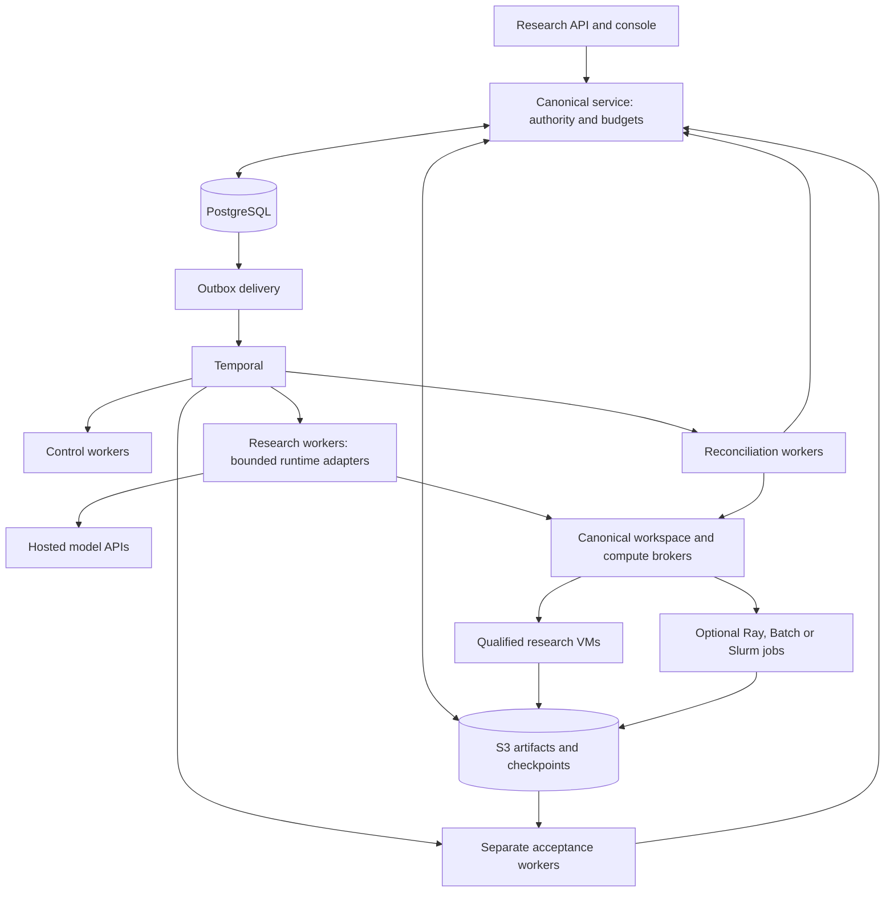

# Scaling PhysHarnessV2 with existing VM and multi-agent infrastructure

Research date: **22 September 2026**. Repository inspected: **`edcb4f12f51f3e08c3f00cb75657f27dfdfd1352`**.

This assessment combines source-code inspection with current primary documentation. Recommendations and capacity examples below are engineering judgments, not measured performance. No cloud resources, paid model calls, or live fleet benchmarks were run. Rolling documentation can describe capabilities newer than an installed release; pin and qualify the actual versions before adoption.

## Recommendation

**Existing frameworks can provide most of the infrastructure needed to scale this project. Preserve PhysHarness's scientific authority and accounting, and replace or extend execution infrastructure behind those boundaries.**

For the first production qualification, retain **Temporal + PostgreSQL + S3 + ECS/Fargate + E2B**, and provision a separately qualified Linux verification fleet. First fix recovery, accounting reconciliation, worker separation, and admission control. This follows the repository's managed-first strategy and uses the largest amount of already implemented integration. It is also a credible candidate for 1,000 research workers; a worker-count milestone alone does not justify a Kubernetes migration.

For a self-hosted or heterogeneous fleet, the strongest path is **managed Kubernetes + separated Temporal workers + KEDA**, with **Agent Sandbox or OpenSandbox over an explicitly qualified runtime** for research workspaces. Use Kata/VM-backed execution when preserving the current VM requirement. Investigate Firecracker directly only when operating the VM substrate itself becomes economically or technically necessary.

Use **Ray/KubeRay for substantial trusted CPU/GPU computation**. Trial **LangGraph or Pydantic AI for bounded research policies**. Neither should become the owner of scientific records, budgets, branch visibility, or proof acceptance. These recommendations distinguish three scaling problems: more execution capacity, more reliable long-running work, and more productive collaboration.

**The highest-value next experiment is a small live E2B qualification with crash recovery, followed by one alternative-provider comparison.** Daytona Linux VM is the closest published comparison for memory-preserving fork; Modal VM Sandboxes are another candidate when compute integration matters more. The choice between them should follow the actual need for RAM cloning, rather than assuming every research branch requires it.

## What the repository actually supports

The existing system has useful foundations: stable workflow identities, a PostgreSQL transactional outbox with `SKIP LOCKED`, leases with fencing, resource reservations, immutable artifacts, model-directed delegation, and independent proof receipts. Those are worth keeping. The [implementation evidence ledger](/Users/kieranpi/Desktop/Projects/PhysHarnessV2/docs/IMPLEMENTATION_STATUS.md) explicitly leaves live providers, the acceptance boundary, 128-worker operation, and 1,000-worker operation unqualified.

| Observed implementation | Scaling implication |
|---|---|
| [One worker process](/Users/kieranpi/Desktop/Projects/PhysHarnessV2/src/physharness/worker.py:164) registers experiment, research, and verification activities on one task queue; it also pumps the outbox. | Split these into independently deployable pools and queues. A 16-thread executor applies to synchronous activities; it is **not** evidence of either a 16-agent fleet limit or sufficient capacity for 128 agents. |
| [Research tasks](/Users/kieranpi/Desktop/Projects/PhysHarnessV2/src/physharness/orchestration/workflows.py:40) run as activities with one attempt, a 24-hour timeout, and heartbeats. Preflight waiting is retried every five seconds. | Deliberately conservative side-effect handling is appropriate. A pod restart cannot safely turn into an automatic new research attempt. Replace repeated eligibility polling with admission/wakeup mechanisms as queue pressure grows. |
| [Prior model sessions block redispatch](/Users/kieranpi/Desktop/Projects/PhysHarnessV2/src/physharness/orchestration/research_worker.py:295) with `RECOVERY_RECONCILIATION_REQUIRED`. | Safe continuation after worker loss is unfinished. Buying a scheduler with automatic restarts does not finish it. |
| The distributed executor [accepts only the Responses runtime](/Users/kieranpi/Desktop/Projects/PhysHarnessV2/src/physharness/orchestration/research_worker.py:312); Codex, Claude, and OpenHands adapters exist separately. | Heterogeneous model-runtime scaling requires controller integration and capability qualification, not merely SDK installation. |
| [WorkspaceBroker requires `provider == "e2b"`](/Users/kieranpi/Desktop/Projects/PhysHarnessV2/src/physharness/orchestration/workspaces.py:128), imports E2B's archive type, and requires `provider_vm` isolation. | Alternative providers are feasible, but **not drop-in configuration changes**. Separate the lifecycle contract, archive format, isolation description, and provider factory. Do not relabel gVisor as a VM to pass a capability check. |
| [Routine workspace cleanup](/Users/kieranpi/Desktop/Projects/PhysHarnessV2/src/physharness/orchestration/workspace_tools.py:85) supplies `actual_cost_usd=None`. | Confirmed destruction can release capacity while financial reservations remain unresolved. A busy fleet needs automated billing reconciliation or conservative, explicitly recorded settlement policies. Otherwise reserved budget accumulates even after successful cleanup. |
| [Portable archives](/Users/kieranpi/Desktop/Projects/PhysHarnessV2/src/physharness/execution/e2b.py:26) cap the serialized archive at 65,536 bytes, individual files at 32,768 bytes, and file count at 64. Native child allocation is rejected by the canonical journal. | Full Lean/Mathlib trees need a versioned streaming artifact design. Provider-native fork is not usable at fleet level until child reservations, lineage, adoption, and cleanup are integrated. |
| [Async research execution](/Users/kieranpi/Desktop/Projects/PhysHarnessV2/src/physharness/orchestration/research_worker.py:290) calls synchronous service/database methods and [synchronous S3 I/O](/Users/kieranpi/Desktop/Projects/PhysHarnessV2/src/physharness/artifacts.py:107). | Network or database latency can block the event loop and delay renewals. Instrument event-loop lag, then move blocking work into appropriately bounded execution paths. Adding replicas does not remove this per-process risk. |
| [Resource reservations](/Users/kieranpi/Desktop/Projects/PhysHarnessV2/src/physharness/service.py:695) lock experiment and budget rows; [lease renewal](/Users/kieranpi/Desktop/Projects/PhysHarnessV2/src/physharness/collaboration.py:143) also locks the experiment via `_active`. | Test one large experiment as well as many small ones. The same-experiment hot row may constrain concurrency before the infrastructure scheduler does. Preserve atomic budget guarantees when optimizing. |
| Session and workspace discovery in the executor enumerates experiment records and filters by task/slot in Python. [Executor](/Users/kieranpi/Desktop/Projects/PhysHarnessV2/src/physharness/orchestration/research_worker.py:295). | Add indexed task/session and slot/workspace queries when measurements confirm the cost. Large campaigns should not repeatedly hydrate unrelated records. |
| [AWS Terraform](/Users/kieranpi/Desktop/Projects/PhysHarnessV2/infra/terraform/aws/services.tf) defines fixed API/worker desired counts. [Self-hosting](/Users/kieranpi/Desktop/Projects/PhysHarnessV2/infra/selfhost/README.md) remains a qualification outline. | ECS autoscaling, worker draining, Kubernetes manifests, sandbox controllers, and a self-hosted VM allocator are additional work. |
| [The verifier](/Users/kieranpi/Desktop/Projects/PhysHarnessV2/src/physharness/verification/container_driver.py:61) requires a particular Linux boundary including Landlock, seccomp, and syscall probes. | A different VM/container runtime requires requalification. A successful research-shell sandbox test does not qualify independent proof acceptance. |

These are observed contracts and potential bottlenecks, not measured claims that PostgreSQL, Python, or Temporal cannot handle the target load.

## Separate the layers before selecting products

Kubernetes and “k8s” name the same platform. Kubernetes, Firecracker, Ray, Temporal, and LangGraph solve different problems and can coexist.

| Layer | Responsibility here | Candidate tools |
|---|---|---|
| Scientific authority | Exact targets, evidence access, budgets, provenance, accepted receipts | Existing PhysHarness service, PostgreSQL, S3 |
| Durable execution | Task lifecycle, waits, cancellation, recoverable orchestration | Existing Temporal |
| Fleet placement | Run trusted services; place and scale compute | ECS, Kubernetes, Nomad, Slurm |
| Sandbox lifecycle | Allocate, identify, pause, reconnect, fork, retire workspaces | E2B, Daytona, Modal, Agent Sandbox, OpenSandbox |
| Isolation | Contain generated programs | Qualified provider VMs, Kata, Firecracker; gVisor under a separately reviewed policy |
| Distributed science | Parallel numerical/search kernels, GPU training/inference | Ray, Dask, Batch, Slurm |
| Agent policy | How researchers choose actions, delegate, critique, and communicate | Existing loop; optional LangGraph, Pydantic AI, Agents SDK, CrewAI, Agent Framework |

For example, 1,000 active research sessions might be served by dozens of trusted worker processes, a variable number of isolated research workspaces, and a separate verifier pool. It does not necessarily mean 1,000 worker pods, 1,000 VMs, or 1,000 GPUs. Hosted models run at their providers. Size each resource separately.

## Fleet schedulers and Kubernetes components

The verdicts below describe suitability for this repository, rather than a generic ranking of the products.

| Option | Useful application | Viability and tradeoff |
|---|---|---|
| **ECS/Fargate** | Existing trusted API, controller, and model-worker services. | **Preferred initial deployment.** Add queue/admission metrics, scaling, and draining. ECS supports custom-metric autoscaling; AWS quotas also cover launch rates, vCPUs, networking, and task counts. Those must be checked in the actual account. A 1,000-agent target does not by itself exceed this architecture. [Autoscaling](https://docs.aws.amazon.com/AmazonECS/latest/developerguide/service-auto-scaling.html), [quotas](https://docs.aws.amazon.com/general/latest/gr/ecs-service.html). |
| **Kubernetes, including managed EKS/GKE/AKS** | Mixed node pools, independent services, secure runtimes, batch and GPU integration. | **Strong conditional choice.** Its documented cluster envelope is far above 1,000 pods; that does not establish application throughput. Most compelling when operating workspace hosts, mixing CPU/GPU workloads, or reusing an existing platform team. [Cluster considerations](https://kubernetes.io/docs/setup/best-practices/cluster-large/). |
| **K3s** | Smaller self-hosted pilot or lab on owned hardware. | A Kubernetes distribution, not an alternate agent framework. Production HA, durable control-plane storage, networking, and sandbox isolation still need design. Useful for validating manifests; not a shortcut around operating a cluster. [Requirements](https://docs.k3s.io/installation/requirements), [HA](https://docs.k3s.io/datastore/ha-embedded). |
| **Nomad** | Mixed container, process, and QEMU VM workloads. | Viable if the operator already knows Nomad. QEMU support could host workspaces, but the sandbox broker/recovery layer remains necessary. Smaller ecosystem fit than Kubernetes for the specific sandbox/Ray integrations considered here. Current Community Edition uses BUSL, so do not describe it as equivalent to an Apache-licensed platform. [Drivers](https://developer.hashicorp.com/nomad/tutorials/get-started/gs-overview), [QEMU](https://developer.hashicorp.com/nomad/docs/deploy/task-driver/qemu), [license](https://developer.hashicorp.com/nomad/docs/ce-license-support). |
| **KEDA** | Scale Kubernetes Temporal worker deployments from queue demand. | A particularly relevant integration; see the concrete scaling cautions below. [Temporal scaler](https://keda.sh/docs/2.20/scalers/temporal/). |
| **Karpenter** | Add/right-size Kubernetes nodes for pending resource requests. | Useful on an appropriate supported cloud setup. It scales nodes, while KEDA scales workloads. Configure disruption/consolidation around checkpoint and drain behavior; neither protects arbitrary in-flight provider effects. [Disruption](https://karpenter.sh/docs/concepts/disruption/). |
| **Kueue** | Admit local CPU/GPU batch jobs under resource quotas and fair sharing. | Strong for many experiments competing for scarce local compute. It does not meter remote model tokens, dollars, or external E2B slots. Keep canonical admission above it, and use supported workload integrations. [Overview](https://kueue.sigs.k8s.io/docs/overview/), [admission fairness](https://kueue.sigs.k8s.io/docs/concepts/admission_fair_sharing/). |
| **Volcano** | Gang scheduling and batch queues for tightly coupled compute. | Relevant if MPI/distributed training needs simultaneous resources. It adds little for independent API-bound researchers. Evaluate alongside the specific HPC workload, rather than installing both Volcano and Kueue by default. [Scheduling actions](https://volcano.sh/docs/scheduler/actions/). |
| **AWS Batch** | Parameter sweeps, numerical campaigns, offline benchmark runs. | Good AWS-native downstream executor; array jobs support 2–10,000 children. Job completion is an input to PhysHarness, not a proof receipt. Less natural than existing Temporal workers for interactive collaborator sessions. [Array jobs](https://docs.aws.amazon.com/batch/latest/userguide/array_jobs.html). |
| **Slurm** | University/owned HPC clusters, MPI, long numerical jobs, GPU allocations. | Excellent conditional fit when such resources already exist. Submit bounded compute from the harness and import checked artifacts. Slurm accounting and queues do not replace scientific budgets or hostile-code isolation. [Overview](https://slurm.schedmd.com/overview.html), [containers](https://slurm.schedmd.com/containers.html). |
| **Argo Workflows** | Reproducible container DAGs for offline evaluation and data processing. | Useful subordinate batch pipeline. Replacing Temporal would create migration work without addressing this project's recovery/accounting gaps. Avoid making both engines co-own the same task. [Argo](https://argo-workflows.readthedocs.io/en/latest/). |

### How Kubernetes would actually apply

Deploy the API and trusted workers as long-lived Deployments. Start with distinct queues/pools for **control**, **research**, **verification**, and **reconciliation**. Queue separation must include workflow/activity routing changes; launching the existing executable under different names does not accomplish it. Choose activity slot limits explicitly for each workload and the pinned Temporal SDK. Temporal distinguishes slots from pollers and provides tuning mechanisms. [Worker performance](https://docs.temporal.io/develop/worker-performance).

Keep PostgreSQL and artifact storage external/managed initially, and preferably keep Temporal managed too. A Kubernetes migration does not require simultaneously operating database failover, S3-compatible storage, and Temporal server persistence. That would multiply the work needed to isolate a failure.

**KEDA:** configure activity-queue demand for research work; the scaler defaults to workflow queues. Combine queue pressure with in-flight work, oldest eligible task age, provider headroom, and available canonical budget. Backlog alone can fall to zero while paid activities still run; the KEDA documentation explicitly warns about scaling to zero. Begin with a nonzero worker floor and drain-aware scale-in. [Scaler semantics](https://keda.sh/docs/2.20/scalers/temporal/).

Use Jobs for bounded computations and verifier dispatch where appropriate, not one new Job per model message. Kubernetes explicitly allows duplicate program starts even for a single-completion Job. Preserve operation IDs, fenced writes, and provider reconciliation. Neither `restartPolicy: Never` nor setting a retry count to zero proves exactly-once execution. [Job semantics](https://kubernetes.io/docs/concepts/workloads/controllers/job/).

Separate trusted controllers, research workspaces, and acceptance execution into distinct security/resource domains. At minimum use dedicated identities, suitable node pools, explicit RuntimeClasses, resource limits, and an enforcing CNI. Namespace boundaries alone do not provide the required execution isolation. The Kubernetes documentation notes that NetworkPolicy is ineffective without a supporting network plugin. [Multi-tenancy](https://kubernetes.io/docs/concepts/security/multi-tenancy/).

For workspaces, broker access should be an authenticated control channel while arbitrary guest egress remains disabled. Remove guest service-account tokens, cloud metadata access, provider keys, and control-plane mounts. Build dependencies into qualified images before disabling egress. Use separate reviewed ingestion tools for literature or package requests. These follow the repository's credentialless-workspace design.

**Decision trigger:** choose Kubernetes when it materially simplifies an owned sandbox fleet, GPU/mixed-resource scheduling, or an existing organizational deployment standard. Stay on ECS when it remains a smaller, reliable operational surface. On ECS, task scale-in protection can help drain long work; it protects against specified scaling/deployment events, not every failure. [ECS protection](https://docs.aws.amazon.com/AmazonECS/latest/developerguide/task-scale-in-protection.html).

## VM and sandbox platforms

Memory preservation, persistent disk, and durable workflow state are distinct capabilities. A “snapshot” may mean any one of them. All options below require adaptation to PhysHarness's identity, reservation, fencing, and artifact contracts.

| Platform | Relevant capability | Application and qualification burden |
|---|---|---|
| **E2B** | The existing adapter implements VM commands, files, pause/resume, snapshots, and fork, with no-egress creation. [SDK source](https://github.com/e2b-dev/E2B/blob/main/packages/python-sdk/e2b/sandbox_async/main.py). | **Keep as baseline.** The canonical broker and accounting integration are an advantage. Live qualification, restart adoption, billing reconciliation, realistic archives, and native-child orchestration are still required. Current plan/size economics are below. |
| **Daytona Linux VM** | Published VM pause/resume and independent memory/filesystem fork; explicit network controls. [Sandboxes](https://www.daytona.io/docs/sandboxes), [network limits](https://www.daytona.io/docs/en/network-limits/). | **Best direct native-fork comparison.** Qualify the Linux VM product, tier, CPU/RAM pool, and no-egress behavior through every lifecycle operation. A parent cannot be deleted while active fork children remain: model cleanup order and retained parent costs. Container behavior is not interchangeable with VM behavior. |
| **Modal Sandboxes / VM Sandboxes** | Python APIs, filesystem snapshots, network blocking, and a distinct VM product; base sandboxes use gVisor. [VMs](https://modal.com/docs/guide/vm-sandboxes), [network](https://modal.com/docs/guide/sandbox-networking). | Strong alternate when combining agent tools with scalable compute. Standard sandbox lifetime is bounded; memory snapshots have alpha/availability constraints, so confirm the exact product contract. Filesystem cloning is useful even when RAM cloning is unavailable. [Lifetimes](https://modal.com/docs/guide/sandboxes), [snapshot semantics](https://modal.com/docs/guide/sandbox-snapshots). |
| **Runloop Devboxes** | MicroVM workspaces, suspend/resume, disk snapshots, network policies. [Snapshots](https://docs.runloop.ai/docs/devboxes/snapshots), [network controls](https://docs.runloop.ai/docs/network-policies). | Credible disk-checkpoint alternative. Published snapshots are disk-only; resume the model and processes explicitly. Default egress must be restricted. Qualify API reconnection, snapshot charges, available capacity, and configured maximum lifetime; the documented default is one hour. [Lifetime](https://docs.runloop.ai/docs/devboxes/start-stop). |
| **Fly.io Sprites** | Persistent filesystem and automatic idle suspension; cold wakes discard memory, warm wakes may preserve it. [Lifecycle](https://docs.sprites.dev/concepts/lifecycle/). | Interesting for intermittent researchers with expensive installed environments. Do not rely on warm memory survival. Verify enforceable resource/cost bounds and network containment; a documented DNS policy is not by itself proof that every direct-IP/metadata path is blocked. [Policy API](https://docs.sprites.dev/api/dev-latest/policy/). |
| **AWS AgentCore Runtime** | Managed isolated agent sessions; separate newer Instances mode offers different persistence and trust semantics. [Runtime](https://docs.aws.amazon.com/bedrock-agentcore/latest/devguide/agents-tools-runtime.html), [Instances](https://docs.aws.amazon.com/bedrock-agentcore/latest/devguide/runtime-instances-how-it-works.html). | More natural as a trusted agent host than an immediate replacement for this broker. Session lifetimes, storage behavior, execution-role credentials, and native fork requirements need a product-specific review. Keep generated code away from privileged agent-host credentials. [Security](https://docs.aws.amazon.com/bedrock-agentcore/latest/devguide/runtime-security-best-practices.html). |
| **Cloudflare Sandbox SDK** | VM-backed container execution with Workers integration, egress controls, and directory backup/restore. [Security](https://developers.cloudflare.com/sandbox/concepts/security/), [backup](https://developers.cloudflare.com/sandbox/guides/backup-restore/). | Viable if Cloudflare is already the platform. Adds a Worker/SDK bridge to this Python stack. Container disk is ephemeral across relevant lifecycle transitions; directory backup is not a live-memory branch. Account/instance limits need confirmation. [Container FAQ](https://developers.cloudflare.com/containers/faq/). |
| **Docker Sandboxes** | Developer-oriented microVM execution and network controls. [Overview](https://docs.docker.com/ai/sandboxes/), [isolation](https://docs.docker.com/ai/sandboxes/security/isolation/). | Useful for local development and containment experiments. It is not, by itself, a demonstrated 1,000-workspace allocation/reconciliation service. A fleet still needs hosts, remote control, credentials, accounting, and lifecycle automation. |
| **Kubernetes Agent Sandbox** | SIG Apps controller with Sandbox identity/lifecycle, persistent storage, templates, claims, and warm pools. Isolation is delegated to RuntimeClass implementations. [Project](https://github.com/kubernetes-sigs/agent-sandbox). | **Priority self-hosted prototype.** Reuse lifecycle primitives instead of implementing a new Kubernetes sandbox controller. Validate release maturity and exact persistence semantics; the CRD does not itself provide VM isolation or application budgets. |
| **Alibaba OpenSandbox** | Lifecycle/execution APIs and SDKs over Docker/Kubernetes; Kubernetes integrates controller backends and secure runtime choices. [Architecture](https://open-sandbox.ai/architecture/), [project](https://open-sandbox.ai/). | **Alternative/complement to Agent Sandbox.** Potentially saves command/file API development. Docker and Kubernetes backends differ; a plain Docker backend does not satisfy the current VM requirement. Rolling docs explicitly require package/version checks. [SDK availability](https://open-sandbox.ai/sdks/). |
| **Kata Containers** | A VM-backed OCI runtime for Kubernetes pods. [Project](https://katacontainers.io/learn/), [quick start](https://github.com/kata-containers/kata-containers/blob/main/docs/quick-start-guide.md). | Strong self-host isolation candidate underneath a sandbox controller. Confirm KVM/nested-virtualization support on selected nodes. VM isolation does not automatically supply durable fork, remote exec, cost accounting, or compatible acceptance syscalls. |
| **gVisor** | User-space kernel isolation via `runsc`. [Architecture](https://github.com/google/gvisor/blob/master/g3doc/architecture_guide/intro_to_gvisor.md). | Worth benchmarking for research tool workloads if policy permits it. It is a different isolation mechanism from a hardware VM; test syscall compatibility and Lean/Python/Node performance. Treat acceptance-boundary compatibility as a separate question. |
| **Firecracker** | KVM microVM engine with memory/state snapshot support. [Project](https://firecracker-microvm.github.io/), [snapshots](https://github.com/firecracker-microvm/firecracker/blob/main/docs/snapshotting/snapshot-support.md). | Maximum infrastructure control with the largest engineering burden: host pool, images, disk layers, allocator, network policy, patching, reconciliation, and GC. Snapshot files do not package every external resource. Network filtering is a host responsibility. [Host setup](https://github.com/firecracker-microvm/firecracker/blob/main/docs/prod-host-setup.md). |
| **KubeVirt** | Kubernetes management of full VMs, storage snapshots, and live migration. [Guide](https://kubevirt.io/user-guide/), [snapshots](https://kubevirt.io/user-guide/storage/snapshot_restore_api/). | Better for persistent full-machine environments or VM consolidation than the initial short-workspace path. CSI/storage/migration prerequisites add operations. A storage snapshot does not inherently preserve RAM/process state. |
| **Incus / Proxmox VE** | General-purpose VM/container fleet management on owned infrastructure. [Incus](https://linuxcontainers.org/incus/docs/main/), [Proxmox](https://pve.proxmox.com/pve-docs/pve-admin-guide.pdf). | Viable for a modest lab or an organization with existing hosts and expertise. Requires a dedicated PhysHarness provider adapter and enforced VM/network policy. Incus containers must not be mistaken for its VM mode. Neither supplies scientific-agent lifecycle semantics. |

**A material sourcing correction:** Daytona announced on 11 June 2026 that its production codebase is becoming closed source and its old public core repository will no longer receive maintenance. Treat the current service as a hosted/proprietary option, not an actively maintained open-source self-host baseline. Its BYOC region chart retains a Daytona-hosted control plane. [Announcement](https://www.daytona.io/dotfiles/updates/daytona-is-going-closed-source), [BYOC chart](https://github.com/daytonaio/helm-charts/blob/main/charts/daytona-region/README.md).

### The self-hosted sandbox integration to prototype

Have `WorkspaceBroker` request a named SandboxClaim with a canonical operation ID, then record the allocated Sandbox and actual pod/VM incarnation. Kubernetes object names or stable hostnames are not sufficient execution identities across replacement. A restarted pod may preserve disk while losing processes; fence and reconcile it as the correct lifecycle transition.

Agent Sandbox's warm pools can lower allocation latency, but unused warm capacity and retained storage still cost money. Pool only clean, qualified templates and do not recycle private workspace state across branches. Native memory fork is a separate acceptance criterion from assigning a prestarted sandbox. [Agent Sandbox](https://github.com/kubernetes-sigs/agent-sandbox).

OpenSandbox can sit above an agent-sandbox backend, so these are not always competing full stacks. Select one lifecycle owner for each workspace. Its documented Kubernetes rootfs pause/resume persists filesystem state rather than running processes/RAM; separate VM-state mechanisms have different prerequisites. Translate these capabilities honestly instead of promising the existing E2B memory-resume contract. [Architecture](https://open-sandbox.ai/architecture/), [Kubernetes lifecycle](https://open-sandbox.ai/kubernetes/).

## Agent and distributed-compute frameworks

| Framework | What it would contribute | Fit for this project |
|---|---|---|
| **Temporal** | Durable workflows, signals, timers, activities and queues. [Workflows](https://docs.temporal.io/workflow-execution), [activities](https://docs.temporal.io/activity-execution). | **Retain.** Replay recovers orchestration state; external side effects still require idempotency/reconciliation. Improve current integration before switching engines. |
| **LangGraph** | Stateful graph policies, checkpoints, interrupts, structured specialist loops. [Persistence](https://docs.langchain.com/oss/python/langgraph/persistence), [interrupts](https://docs.langchain.com/oss/python/langgraph/interrupts). | **Good bounded policy experiment.** Run inside a canonical branch/task, with brokered tools. Checkpoints form another state system and interrupted nodes can replay side effects. Do not let graph stores bypass branch visibility. |
| **Pydantic AI / Harness** | Typed Python agents, subagents, usage controls and Temporal integration. [Multi-agent](https://pydantic.dev/docs/ai/guides/multi-agent-applications/), [durable execution](https://pydantic.dev/docs/ai/capabilities/durable_execution/overview/). | **Good alternative bounded pilot.** Particularly aligned with this Python/Pydantic codebase. Its limits are not substitutes for pre-request canonical reservations; see the explicit caveat below. |
| **OpenAI Agents SDK** | Handoffs, agents as tools, sessions, tracing, reusable run machinery. [Orchestration](https://openai.github.io/openai-agents-python/multi_agent/), [runner](https://openai.github.io/openai-agents-python/running_agents/). | Optional replacement for a local policy loop, with substantial overlap with the existing Responses adapter. A handoff is not automatically a separate durable worker/VM. Filter forwarded history and meter every nested model call. [Handoffs](https://openai.github.io/openai-agents-python/handoffs/). |
| **CrewAI** | Role-based teams, hierarchical delegation, event-driven flows and persisted flow state. [Crews](https://docs.crewai.com/en/concepts/crews), [Flows](https://docs.crewai.com/en/concepts/flows). | Useful equal-budget research-policy baseline. Lower infrastructure priority: it overlaps existing branches, messages, task dependencies and workflow ownership. Manager-generated descendants must still enter canonical accounting. |
| **Microsoft Agent Framework** | Typed agents/workflows, collaboration patterns, checkpoints; Durable Extension supports distributed execution. [Overview](https://learn.microsoft.com/en-us/agent-framework/overview/), [durable hosting](https://learn.microsoft.com/en-us/agent-framework/hosting/azure-functions). | Serious alternative for a new Azure/.NET-oriented system, or an isolated policy trial here. Its durable backend would introduce another execution engine beside Temporal. No clear reason to migrate this project around it. |
| **AutoGen** | Established group-chat/team patterns and event-driven agents. Microsoft provides migration to Agent Framework. [Migration](https://learn.microsoft.com/en-us/agent-framework/migration-guide/from-autogen/). | Keep as a research comparison if useful; avoid a new foundational commitment when evaluating Microsoft's current successor. |
| **OpenHands SDK** | Remote code-agent execution with workspace/conversation state. [SDK](https://www.openhands.dev/product/sdk). | Qualify the existing adapter for Lean/code-heavy work. Complete distributed integration and portable branch-memory handoff; native continuation remains tied to the same qualified VM/runtime, not a replacement VM. [Adapter contract](/Users/kieranpi/Desktop/Projects/PhysHarnessV2/docs/OPENHANDS_RUNTIME.md). Adding another framework above it should have a measured reason. |
| **Ray / KubeRay** | Distributed Python tasks, actors, CPU/GPU resources and Kubernetes cluster/job management. [Core](https://docs.ray.io/en/latest/ray-core/key-concepts.html), [KubeRay](https://docs.ray.io/en/latest/cluster/kubernetes/getting-started.html). | **Strong for computational subjobs.** Use for trusted numerical kernels, large search batches, training, or inference. It is not needed just to run many async hosted-model requests. |
| **Dask Distributed** | Numerical/data task graphs, futures and distributed execution. [Futures](https://docs.dask.org/en/stable/futures.html), [resilience](https://distributed.dask.org/en/latest/resilience.html). | Good when the scientific code is already array/dataframe/Dask-oriented. Recomputed tasks and scheduler recovery semantics make it unsuitable as the canonical side-effect ledger. |
| **Prefect / Dagster** | Python workflow execution; asset/data pipeline management. [Prefect](https://docs.prefect.io/v3/concepts/flows), [Dagster](https://docs.dagster.io/getting-started/quickstart). | Useful for later paper ingestion, dataset construction or offline evaluations. They add little to the existing interactive campaign controller unless a specific pipeline warrants them. |

### Multi-agent framework adoption conditions

The project already supports optional helpers, collaborators, competing branches, and sharing modes `none`, `verified`, and `ideas`. A generic shared group-chat history can violate those experiment controls. New frameworks must call the existing delegation/message/knowledge interfaces with server-assigned identities rather than inventing parallel authority.

Pydantic AI's current subagent docs explicitly distinguish child-local usage from parent accounting. Its SpendLimits documentation describes a post-response limit that can overshoot under concurrent work and says it is not an accounting ledger. This is a useful example of why “has budget controls” is insufficient here. Intercept and reserve **every** paid call, including manager/critic/subagent calls, or decline that capability. [Subagent accounting](https://pydantic.dev/docs/ai/harness/subagents/), [spend limits](https://pydantic.dev/docs/ai/harness/spend/).

For any policy pilot, preserve exact model and target revisions, tool operation IDs, native session IDs, token usage, cancellation propagation, and artifact provenance. Checkpointing model history, graph state, files, and VM memory should remain separately identifiable. A new runtime's native conversation store is not automatically portable across worker hosts.

**Brokered tools alone do not qualify an SDK.** An SDK-managed model loop can bypass the current Responses adapter's `generation_started` reservation and usage events. Require a qualified `RuntimeAdapter`, or an equivalent per-generation preflight and idempotent usage/reconciliation path, for every manager, critic, and child call. Reject pilots that cannot expose that boundary reliably.

Ray actors and Dask workers are trusted compute processes, not the containment boundary for arbitrary generated code. Ray documents automatic task retries and the need to restore application actor state; failures can leave method outcomes ambiguous. Keep paid model requests, VM allocation, and authoritative publication outside automatic compute retries unless canonical reconciliation handles them. Return hashed outputs to PhysHarness and let the independent verifier decide acceptance. [Ray task failures](https://docs.ray.io/en/latest/ray-core/fault_tolerance/tasks.html), [actor failures](https://docs.ray.io/en/latest/ray-core/fault_tolerance/actors.html).

Do not run two durable engines as competing owners of the same task. If a framework supplies Temporal integration, choose explicitly whether its state is a branch-local subworkflow or whether the existing `TaskWorkflow` continues to own execution. Document which system retries each boundary and which one commits completion.

## Proposed target architecture

This is a proposed deployment shape; it is not implemented by this research.

Research code reaches artifacts through controlled transfer paths; the arrows do not grant guest credentials or direct canonical write authority. ECS or Kubernetes can host the trusted worker services. A self-hosted sandbox pool can be introduced while the API, database and Temporal remain managed elsewhere, subject to measured networking latency and recovery behavior.

## Capacity and cost: what to measure before scaling

**Useful research concurrency is bounded by the smallest of model-rate capacity, eligible budgeted tasks, sandbox capacity, database/control throughput, and verifier throughput.** VM count alone is an incomplete metric.

The following are explicit sizing examples, not workload measurements:

| Assumption | 128 active sessions | 1,000 active sessions | Consequence |
|---|---:|---:|---|
| One model call/session/minute, averaging 8,000 input + 2,000 output tokens | 128 requests/min; 1.28M tokens/min | 1,000 requests/min; 10M tokens/min | Validate provider limits per model, token class, organization, and region; a Kubernetes autoscaler cannot create provider capacity. |
| Existing lease renewal every 10 seconds, with a unique canonical renewal command | 12.8 renewals/s | 100 renewals/s | At steady occupancy, about 3.32M and 25.92M renewal commands respectively over 72h, before other writes. Profile locking, retention, and storage growth. |
| Every session continuously holds 2 vCPU + 4 GiB workspace | 256 vCPU; 512 GiB | 2,000 vCPU; 4,000 GiB | Request actual provider resource quotas and size for compiler memory peaks. This excludes verifier/control capacity and overhead. |
| 1,000 sessions each submit one candidate per 10 min; verification averages 30 seconds | — | 50 busy verifier slots on average | At a proposed 70% average utilization target, approximately 72 slots, plus variability headroom. Measure service-time tails and cache behavior. |

At the inspected E2B list rates, 2 vCPU + 4 GiB costs **$0.1656 per running sandbox-hour**. Continuous 72-hour compute is approximately **$1,526 for 128** or **$11,923 for 1,000** sandboxes. Pro lists $150/month, 100 included concurrency, +$500/month for 600 or +$1,000/month for 1,100. Base Pro therefore does not cover 128 simultaneous sandboxes. These figures exclude model calls, control/verification services, additional storage and other charges; discounts and billing-period treatment require confirmation. Pro sessions are capped at 24h, so a 72h campaign requires turnover or different terms. [Pricing snapshot](https://e2b.dev/pricing).

The computation is `3600 × (2 × 0.000014 + 4 × 0.0000045) = 0.1656`. The 2/4 shape is an illustration, **not a validated Lean workspace size**. If only 25% of sessions need a running workspace at once, the variable compute term can fall substantially, provided pause/reconnect is safe and caches are retained. Savings are not automatic: idle warm pools, memory retention, retained disks, snapshots, and minimum charges can remain billable.

For a vendor-neutral comparison use:

`total cost = model usage + running workspace compute + retained storage/snapshots + verification + control services + orchestration/telemetry + networking + engineering/operations`

Compare cost per accepted target and useful lemma reuse under the same model and research budget. Do not conclude that self-hosting is cheaper from VM-hour rates alone. A migration earns its cost when sustained utilization, isolation needs, or workload flexibility outweigh host capacity, maintenance, incident response, and adapter development. Request written capacity and cost terms only after measuring the required CPU/RAM/residency distribution.

## Concrete implementation sequence

The sequence below is a recommendation for subsequent implementation, not authorization to launch paid work.

| Step | Repository work | Evidence needed before advancing |
|---|---|---|
| **1. Establish a live baseline** | Pin reviewed targets, qualified environment/verifier, exact model, E2B template and bounded experiment envelope. | One genuine accepted result and successful evidence reuse with complete accounting. Run the existing acceptance/adversarial gates against actual binaries. |
| **2. Make recovery operable** | Add a canonical reconciler for pending/uncertain model and VM operations, explicit session continuation, lease adoption, orphan inventory and billing settlement. | Inject create-success/response-loss, worker death, lease expiry, interrupted upload, and failed destroy. Recover using recorded identities; no uncontrolled replacement allocation. |
| **3. Separate and instrument workers** | Split worker modes and task queues in `worker.py`, workflow routing and delivery. Add bounded activity concurrency, drain behavior, query improvements, and blocking-I/O handling. | Queue age, event-loop lag, lease-renewal latency, database lock time, artifact I/O, verifier backlog and cancellation latency remain within stated targets under load. |
| **4. Generalize workspace contracts** | Extract provider-independent archive/lifecycle types; extend capability validation and factory configuration; add streamed manifests and child reservation/lineage. | Same contract/failure suite against E2B and one alternative. Enforce isolation facts and distinct execution incarnations; preserve unknown-cost reservations. |
| **5. Qualify 128 active workers** | Start at small concurrency, progress through 8/32/128, establish provider quotas and admission controls. | The roadmap's 72-hour mixed workload with useful work, deliberate failures, lifecycle turnover, accepted artifacts, invoice reconciliation, and independent acceptance. Report actual busy/idle/model/VM/verifier activity separately. |
| **6. Choose the deployment expansion** | Continue ECS if adequate; otherwise prototype managed Kubernetes with KEDA and one sandbox lifecycle stack/runtime. | Side-by-side measured cost, recovery, latency and operational effort. Migration must preserve canonical records and authority. |
| **7. Qualify 1,000 workers** | Add fair admission, provider-rate governance, workload-aware queues, verifier backpressure, database/query tuning; Ray/Batch/Slurm only for demonstrated compute needs. | Meaningful accepted/reused output at 1,000, sustained recovery, no unexplained resource/financial growth, and documented bottlenecks. Ten replicas of a smaller successful test are not qualification. |
| **8. Evaluate agent policies** | Compare existing direct/independent research with one LangGraph/Pydantic/other policy at a time behind canonical tools. | Matched-cost and matched-time benefit in acceptance and reuse; account for coordination tokens, duplication, reviewer work and branch information leakage. This can run earlier on small qualified infrastructure. |

Build admission controls for resources the infrastructure scheduler cannot see: per-model RPM/TPM, experiment money/token envelopes, descendant counts, provider workspace quotas, and pending verification. Release eligibility with explicit signals when dependencies/budget/capacity change. Preserve the current principle that unknown paid outcomes remain reserved until reconciliation.

For caches, pin the environment and trusted dependency closure. Share immutable qualified Lean/library assets where safe, and give each candidate isolated writable state. Do not promote model-modified build artifacts or a cloned workspace into a trusted verifier cache. Scientific correctness remains an independent acceptance decision.

## Evaluation plan for the shortlisted providers

Use the same qualified toolchain and resource shape for E2B and **one** of Daytona Linux VM or Modal VM Sandboxes. For a required self-hosting comparison, use Agent Sandbox plus Kata before committing to a bespoke Firecracker allocator.

| Test family | Required observations |
|---|---|
| Useful workload | Cold/warm Lean compilation, incremental edit-check loops, Python numerical work, Node research programs, artifact transfer and a real candidate-to-receipt path. |
| Capacity | Sustained active work, CPU/RAM peaks, allocation ramp limits, p50/p95/p99 command latency, verifier queue age, provider throttling, and account resource ceilings. |
| Lifecycle | Filesystem vs memory restoration, parent/child independence, template/environment identity, snapshot expiry, VM lifetime turnover, reconnect after controller restart. |
| Isolation | Guest cannot access controller/provider credentials, peer private artifacts or unapproved egress; repeat after pause/fork/restore. Acceptance kernel/syscall checks are a separate qualification. |
| Ambiguous effects | Provider success with lost response, process crash before canonical commit, failed cancellation/destruction, late old-worker results and database outages. |
| Accounting | Every active/uncertain resource has a canonical owner/reservation; known destruction and settled invoice are distinguished; child/snapshot/retained-storage costs are included. |
| Recovery | Measure time to resume useful work, lost/repeated computation, orphan lifetime, unresolved financial exposure, and whether any authoritative result was lost or misattributed. |
| Research value | Accepted root targets, reusable sublemmas, cost per acceptance, duplicated effort, reviewer load, and matched-budget baseline comparison. |

The recommendation changes if measurements show a different workload: strong GPU/MPI demand favors Ray or Slurm earlier; existing Kubernetes expertise reduces migration cost; sustained high workspace utilization strengthens the self-hosting case; expensive idle residency strengthens pause/persistent-disk alternatives. Without that evidence, the existing managed path plus the identified recovery and scheduling work is the most defensible next investment.
